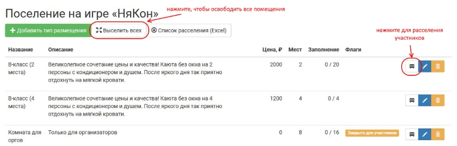

Расселение участников
=====================

Для того, чтобы определить проживание участников в конкретных комнатах с конкретными соседями, воспользуйтесь меню **Прочее > Настройки > Поселение > (иконка «расселение» у нужного типа комнаты)**

	   .. attetion:: Проживание назначается для **человека**, а не для персонажа. В случае смены игрока на роли новому игроку потребуется назначить тип проживания заново.

В комнату нельзя записать больше проживающих, чем мест в каждой комнате этого типа размещения. При заселении в комнату и добавлении новых соседей заявившиеся получают уведомления на электронную почту, также эта информация показывается в заявке в блоке «Проживание».

	   
.. attention:: Список соседей со ссылкой на профиль joinrpg будет виден всем проживающим в этой комнате. Избегайте спойлеров для игроков!

Список участников для типа размещения
-------------------------------------

На вкладке «Комнаты» типа размещения показываются все участники, в заявках которых указан этот тип. Сверху располагаются те, кто еще не приписан к конкретной комнате; те, чье проживание определено, расположены в ячейках соответствующих помещений. Каждая заявка сопровождается указанием, сколько из назначенной к оплате суммы (включая оргвзнос, цену за место проживания, другие выбранные опции) еще осталось оплатить.

Массовое заселение / выселение
------------------------------

* «Заселить  всех»: все комнаты подряд будут заполнены всеми участниками, которые выбрали этот тип размещения.
* «Выселить всех»: для комнат этого типа будут удалены все имеющиеся связи с заявками; заявки, где был выбран этот тип размещения, будут показаны как доступные для размещения и не связанные с конкретными номерами.

.. hint:: Если для вашего мероприятия приниципиально, кто в каком корпусе живет, и не важно, как участники расселятся по номерам, — создайте тип помещения «Корпус 2», в котором будет 40 мест, и разместите в нем участников через массовое заселение.

Функция «Выселить всех» также доступна на странице со списком типов размещения. При ее использовании будут освобождены все комнаты всех типов разменения

Выбор проживающих для каждой комнаты
------------------------------------

* Крестик у имени участника выселяет только этого участника из этой комнаты, такая заявка появится в списке нерасселенных.
* «Заселить в комнату» позволяет добавить конкретно в эту комнату любое число участников, соответствующее числу имеющихся в ней свободных мест.
* «Освободить комнату» перемещает все связанные с этой комнатой заявки в список нерасселенных.