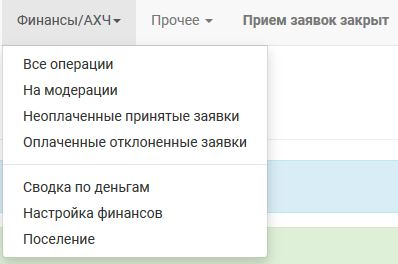
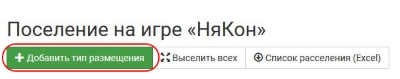

Настройка системы проживания
=============================

Чтобы начать работу с системой проживания, перейдите в своем проекте: **Прочее > Настройки** Выберите опцию «Включить систему проживания». Сохраните настройки проекта.

Теперь в блоке меню **«Финансы/АХЧ»** появился пункт «Поселение». В нем можно настроить типы размещения и добавить конкретное число помещений («комнат») для каждого из них.

Настройка типов размещения
-----------------------------

Типы размещения — это все виды комнат, которые доступны на вашем мероприятии. Для каждого вида комнат можно настроить:

* название — так комнаты этого типа будут отображаться в доступных к выбору;
* цену за одно место — эта сумма будет добавлена к взносу для тех, кому будет выбрано поселение в комнате этого типа;
* число мест — максимальное число участников, которые могут быть заселены в одну комнату такого типа;
* возможность выбрать данный тип проживания пользователям без доступа к вашему проекту (игрокам / участникам конвента);
* описание типа комнаты в свободной форме («вид на залив», «двуспальная кровать и душ в номере», «комнаты для членов профсоюза на Плутоне» и т.п.).

.. hint:: Если ваше мероприятие предусматривает вариант участия «без проживания», добавьте его в типы размещения, чтобы «гости» без ночевки могли указать его в своих заявках с требуемой ценой (можно «0»).

Настройка числа помещений
-----------------------------------

Настройка типов размещения
-----------------------------

Добавление комнат и своевременное добавление связи «заявка — место в поселении» помогает избежать «перебронирования», когда на какой-то тип поселения число запросов избыточно.

.. hint:: Обратите внимание, что число заявок от участников на тип посещения не контролируется базой (чтобы была возможность принимать пожелания по поселению до добавления номерного фонда). Если какая-то категория типов размещения больше не доступна — снимите флаг «Игроки могут выбрать данный тип проживания» в его настройках.

Через вкладку «комнаты» каждому типу размещения добавляются конкретные помещения, которые к нему относятся. Можно использовать списки и диапазоны номеров (например, «1-4» добавит номера 1, 2, 3 и 4), сочетания букв и цифр (1В, D-566) или просто названия («зеленый домик», «подвал»).

.. attention:: Диапазоны номеров можно добавлять только для цифр.

Конкретное число помещений можно добавить позднее. 
