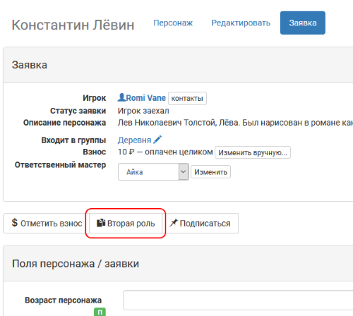
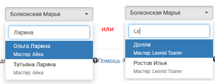

Выход вторыми ролями
========================

Чтобы активировать опцию выпуска вторыми ролями, пройдите в своем проекте: 

**Прочее > Настройки > Настройки регистрации**

Выберите опцию «Разрешить выпуск вторыми ролями». Сохраните настройки.

Выпустить второй ролью можно только игрока, первая заявка которого на игру прошла `процесс регистрации<http://docs.joinrpg.ru/ru/latest/checkin/during.html>`_. Непринятые заявки и незарегистрированных игроков выпустить второй ролью нельзя.

В выпадающем списке персонажей доступен поиск по следующим параметрам:

* имя персонажа;
* ник ответственного мастера.

	   
После нажатия кнопки «Выпустить второй ролью» вы перейдете в интерфейс регистрации игрока новым персонажем. В том случае, если у персонажа, которым вы пытаетесь выпустить второй ролью, не заполнены какие-то обязательные поля, регистрация будет невозможна, но  заявка уже будет привязана к этому персонажу. Перейдите на страницу персонажа и заполните все обязательные и рекомендуемые поля персонажа, повторно пройдите процесс регистрации на полигоне для автоматически созданной заявки во второй роли.

.. hint:: Через меню Персонажи > Проблемные персонажи мастера могут заранее заполнить недостающие поля, тогда выпуск новыми ролями будет происходить максимально оперативно.

Работа с блоком регистрации для игроков, выходящих вторыми ролями, ничем не отличается от регистрации только приехавших на игру.
