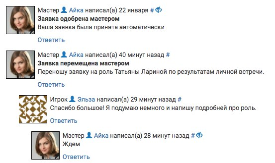
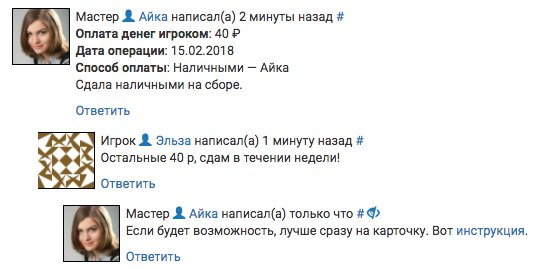
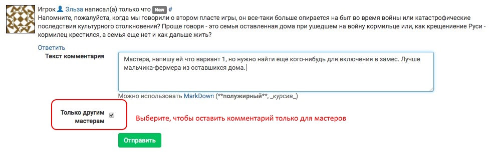
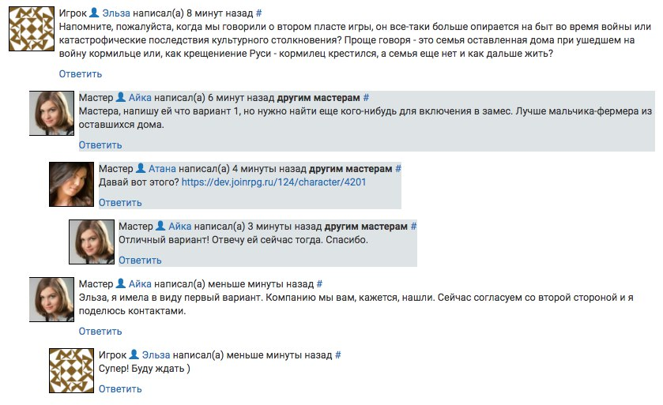
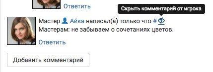
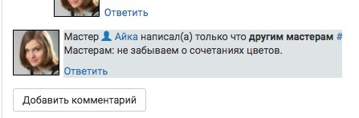

Комментарии в заявке
========================

Для комментариев в заявке используется древовидная система: все сообщения расположены иерархично, в зависимости от того, на какой конкретно комментарий был дан ответ. 

Если при отправке комментария не указано иное, то он будет виден и мастерам, и игроку. 

Комментарии сохраняются за конкретной заявкой (не будут видны новому игроку для того же персонажа), не публикуются при `публикации игровых материалов после игры </project/after.html>`_.

Игроку приходят уведомления о любых видимых ему комментариях на e-mail. Ответственному за заявку мастеру приходят любые комментарии (как от игрока, так и от других мастеров). Остальные мастера `могут подписаться на уведомления о новых комментариях </communication/subscriptions.html>`_; также уведомления приходят тому мастеру, на комментарий которого вы отвечаете, вне зависимости от его личных настроек уведомлений.

Автоматические комментарии
---------------------------------

Большинство значимых операций с заявкой (изменение статуса заявки, информация об отправке игроком и приеме мастером взноса) сопровождается комментарием, который остается в заявке. Такие комментарии имеют выделенный жирным заголовок — название операции, которая была произведена. Старайтесь оставлять значимые комментарии, которые помогут вам в будущем или другому мастеру понять, почему было то или иное решение (например, причины, по которым заявка была отклонена — даже если вы отклоняете «по просьбе игрока»).

.. hint:: Каждый автоматический комментарий открывает новую ветку: если есть какие-то спорные вопросы (например, по поводу перевода взноса), следует их обсуждать именно в этой ветке — так мастер направления, например мастер по АХЧ, точно получит уведомление.

Особенно важно оставлять значимые комментарии в том случае, если вы проводите какие-либо финансовые операции (принимаете взнос, отменяете избыточно переведенный взнос и т.п.). Эти комментарии повысят прозрачность внутренней бухгалтерии мастерской группы и помогут при разборе спорных ситуаций. 

Для информирования мастеров о сдаче взноса пользуйтесь `специальной функцией </for_players/inform_about_payment.html>`_, а не обычными комментариями.

Скрытые комментарии, видимые мастерам
------------------------

Скрытые комментарии видны только другим мастерам (людям, у которых есть доступ в проект). Уведомления о скрытых комментариях приходят только тем мастерам, которые подписаны на комментарии к этой заявке или на чей комментарий оставляется ответ. Чтобы оставить скрытый комментарий, перед отправкой отметьте чекбокс «только для мастеров».

Такие комментарии имеют серый фон. Если вы отвечаете на скрытый комментарий, то ваш комментарий тоже всегда будет скрытым.

	   
Как скрыть ошибочно оставленный комментарий
---------------------------------------------

Комментарий, который был по ошибке оставлен игроку, но предназначался для мастеров, можно на странице заявки скрыть:

После этого комментарий на странице заявки виден не будет, его фон станет серым:	   
	   

	   
.. attention:: Комментарий будет скрыт только на странице заявки. **На e-mail игрока уведомление уже ушло!** Если вы раскрыли этим комментарием игроку значимую информацию, попросите его удалить это письмо, не читая (и полагайтесь на честность).
