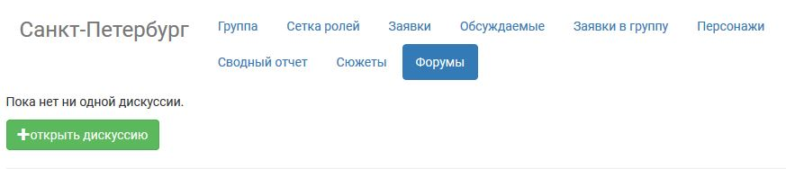
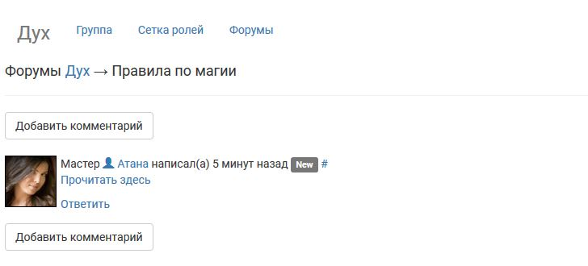

Форумы
========================

Форумы полезны для подготовки групп игроков, которые заявляются отдельно, но должны обсудить какие-то общие завязки. Как и комментарии в заявке, каждый форум имеет древовидную структуру с иерархией сообщений.

По сравнению с общением игроков при подготовке к игре в другой социальной сети, у встроенных форумов есть следующие преимущества:

* Новые игроки, заявка которых была принята в соответствующую группу, подключаются к форуму этой группы автоматически.
* Использование форумов разрешает противоречие между игроками, которые строго предпочитают одну социальную сеть и не желают регистрироваться в другой.
* Уведомления о новых сообщениях на форуме приходят на емейл, так что участники разговора ничего не пропустят.
* Всё общение доступно мастерам, в том числе — недавно подключившимся к проекту и нуждающимся в том, чтобы понять уже существующие договоренности игроков друг с другом.
* На форумах есть возможность оставлять скрытые сообщения, как и в комментариях к заявке. Например, мастера могут сразу обсудить возможность выделения каких-то средств из бюджета игры на обеспечение определенной локации.

Все форумы доступны через меню **Форумы > Все активные**. Форумы могут быть доступны всем игрокам с утвержденными заявками, игрокам из определенных групп или специальных групп, только мастерам.

.. attention:: Доступ к уже открытому форуму нельзя отредактировать.

Общие настройки нового форумах
---------------------------------

Каждый новый форум имеет заголовок и стартовое сообщение. И то, и другое видно всем, у кого есть доступ к этому форуму. Чтобы легче ориентироваться в списке форумов, советуем давать им значимые названия для более легкой навигации. Если вы хотите, чтобы всем участникам пришло уведомление об открытии нового форума — выберите пункт «уведомить по e-mail».

.. figure:: start_discussion.jpg
       :scale: 100 %
       :align: center
       :alt: Открыть новый форум

.. attention:: На странице форума игрокам будет видно название группы, к которой этот форум относится, даже если это скрытая группа. Избегайте спойлеров!

.. hint:: Если форум предназначен для конкретной группы — удобно обозначить это в названии («Королевство Аэдирн: обсуждение завязок», «Хакеры: обсуждение внутренних правил», «Цинтра: строяк крепости» и т.п.), так как на странице со всеми форумами группа не показывается.

Как завести новый форум для всех игроков
------------------------------------

Доступные всем игрокам форумы можно заводить через меню группы «Все роли» или на странице всех форумов.

Перейдите через меню **Форумы > Все активные**. Под общим списком форумов будет предложено открыть форум, доступный для всех игроков.

.. figure:: for_all_menu.jpg
       :scale: 100 %
       :align: center
       :alt: Новый форум для всех через меню

Чтобы открыть форум через меню группы «Все роли», перейдите через меню **Сетка ролей > Сетка ролей**. Над общей сеткой ролей будет меню группы. Выберите «Форумы», на странице «Форумов» — «открыть дискуссию».

.. figure:: for_all_group_allroles.jpg
       :scale: 100 %
       :align: center
       :alt: Новый форум для всех через Все роли
	   
Как завести новый форум для группы
------------------------------------	   
	   
Форумы можно заводить как для любой `группы <http://docs.joinrpg.ru/ru/latest/groups/index.html>`_ или `специальной группы <http://docs.joinrpg.ru/ru/latest/groups/hidden-group.html#id5>`_). Вкладка «Подписки» доступна в общих настройках группы (перейдите к ним кликом по названию группы). 

	   
.. hint:: Если вам нужно создать форум для нескольких групп — объедините их в общую группу.
	   
Как завести новый форум для мастеров
------------------------------------

Для открытия нового форума с доступов только для мастеров:

1. Заведите новый форум (для группы «Все роли» или любой другой группы).
2. Поставьте галочку «только для мастеров».

Как и во всех других случаях, сообщения, которые недоступны никому из игроков, будут показаны на сером фоне. Для снижения путаницы советуем отдельно обозначить, что форум только для мастеров, в стартовом сообщении и заголовке.	   

.. figure:: for_masters_only.jpg
       :scale: 100 %
       :align: center
       :alt: Новый форум для Мастеров

Примеры, как форумы выглядят для игроков
--------------------------------------------

Форумы, к которым у игрока есть доступ, показываются ему на странице всех активных форумов. К ней можно перейти через меню **Форумы > Все активные**.

Общий список форумов, доступных игроку:

.. figure:: forums_for_players.JPG
       :scale: 100 %
       :align: center
       :alt: Форумы игрока

Отдельная дискуссия, доступная игроку:

