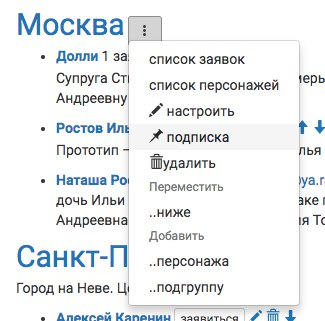
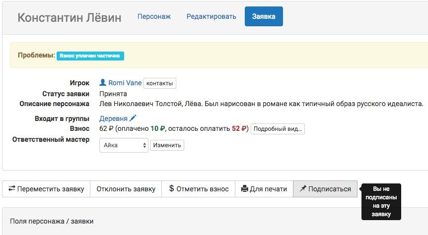

Подписка
========================

Вся информация, на уведомление о которой вы подписаны, приходит на ваш e-mail.

**Всегда** приходят уведомления:

* игрокам о новых комментариях в их заявках, а также изменении любых свойств заявки или персонажа, если заявка утверждена;
* о новых комментариях мастеру, указанному в качестве ответственного у этой заявки;
* о комментарии в ответ на оставленный вами.

Все остальные уведомления требуют дополнительной настройки. 

Подписка на группу
-------------------------------

Меню настройки подписок доступно из управления группой. Его можно выбрать в сетке ролей, нажав три точки рядом с названием группы **Меню → Сетка ролей → Группа → Подписка**

Вкладка «Подписки» доступна и в общих настройках группы (перейдите к ним кликом по названию группы):
	   
.. figure:: from_group.jpg
       :scale: 100 %
       :align: center
       :alt: Настройки подписки из свойств группы	   
	   
Можно отдельно подписаться на следующие типы уведомлений:

* изменение статуса заявок в группе (прием, отклонение или отзыв игроком, перенос в лист ожидания), подачу новых заявок;
* комментарии (текст комментария сразу приходит на почту);
* изменение полей персонажа / заявки;
* финансовые операции (отметка о сдаче взноса игроком, подтверждение приема взноса мастером);
* поселение (изменение типа поселения и назначение «комнаты» для проживания).

Отметьте необходимые пункты, сохраните.

.. hint:: Если вам нужно подписаться на какие-либо уведомления вообще по всем заявившимся на вашу игру, то настройте подписку для группы «Все роли».

Возможно подписаться на уведомления о разных событиях для разных групп. Например, если региональный мастер Аэдирна также отвечает за прием взносов, то он может быть подписан на комментарии и новые заявки / изменение статуса в его локации, Аэдирне, а также — на финансовые операции всех ролей.

Подписка на заявку
-------------------------------

В каждой отдельной заявке доступна возможность подписаться только на нее. При подписке на конкретную заявку будут приходить уведомления о любых изменениях в ней.

.. hint:: Если нужной группы нет, а нужно подписаться на много тематических заявок (например, всех магов, медиков, эльфов) — то такую группу точно стоит создать. Она может быть как частью сетки ролей (возможно, скрытой от игроков), так и специальной — автоматически создаваемой на основании проставленных значений полей персонажа («специальные способности», «раса» и т.п.). `Как создавать группы и с ними работать — можно почитать здесь <http://docs.joinrpg.ru/ru/latest/groups/index.html>`_.

.. attention:: Не используйте подписки на отдельные заявки в том случае, если вы региональный мастер или мастер по направлению. Велик шанс при ручной настройке подписки пропустить нужную заявку! Воспользуйтесь советом выше и подпишитесь на группу.
