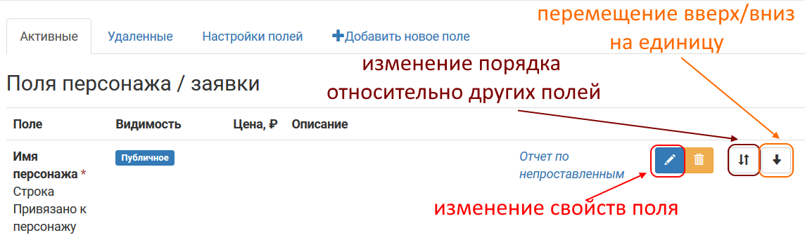
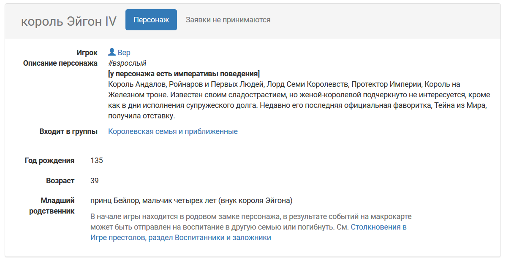
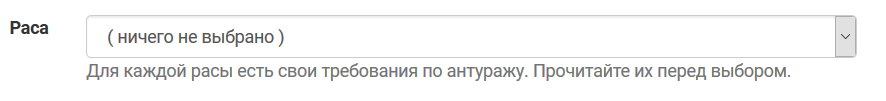
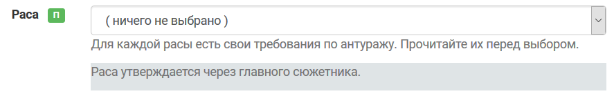

Настройки свойств конкретного поля
====================================

Все настройки изначально задаются при создании поля. Если вам требуется отредактировать уже имеющееся поле, перейдите **Прочее > Поля персонажа / заявки** и выберите кнопку для редактирования:

	   
Также на этой странице можно изменить порядок вывода полей — подвинуть конкретное поле на одно деление вверх/вниз (поменять местами с соседним) или изменить положение относительно других полей (поставить в начало, в конец или после конкретного поля).

.. attention:: Если эти кнопки вам не видны, а добавление новых полей недоступно — у вас нет `права настраивать поля для проекта <http://docs.joinrpg.ru/ru/latest/project/access.html#id3>`_.

**Тип поля** — что это за поле. Нельзя менять после создания поля. 

**Привязано к персонажу / заявке**. `Подробнее про разницу между персонажем и заявкой <http://docs.joinrpg.ru/ru/latest/fields/character_vs_application.html>`_. Нельзя менять после создания поля.

**Обязательное?** — задает возможность сохранять персонажа/заявку, если это поле не заполнено.

* *Обязательное* — никакие действия с заявкой / персонажем не возможны без заполнения этого поля. Прежде, чем сделать поле обязательным, — подумайте, правда ли вы не готовы принимать заявку без его заполнения.

.. hint:: В любом случае, лучше минимизировать обязательность полей типов «строка» и «текст» (такие, куда игрок должен вписать что-то руками). Это приводит к появлению большого числа ответов «позже» и «потом», но не повышает фактическую заполняемость.

* *Рекомендованное* — никакие действия не блокируются, но заявки с незаполненными рекомендованными полями особым образом помечаются в общем списке, для мастеров есть возможность отфильтровать все заявки или всех персонажей, у которых не заполнено конкретное поле.
* *Опциональное* — обычное поле без требований по обязательности, заявки с незаполненными опциональными полями никак не выделяются.  

Как обязательные, так и рекомендованные поля используются при проверке, готова ли заявка к `прохождению регистрации<http://docs.joinrpg.ru/ru/latest/checkin/before.html>`_.

**Публичное** — поле видно на карточке персонажа всем. Пример карточки персонажа с некоторыми общедоступными полями (в данном случае возраст персонажа и младший родственник общеизвестны):

	   
**Видно игроку** — поля персонажа/заявки, которые доступны залогиненному игроку для просмотра (у его персонажа). 
Поля, скрытые от игроков вашего проекта, имеют серый фон.

**Игрок может менять** — доступ к редактированию поля. Для полей типа выбор/мультивыбор можно запретить выставление каждого значения в отдельности в свойствах значения (например, если заявки на эльфов больше не принимаются).

**Показывать даже при непринятой заявке** — игрок будет иметь возможность редактировать поле при подаче заявки (например, выбрать социальную группу своего персонажа). 

.. warning:: При принятии заявки с заполненным игроком _**полем персонажа**_ у имеющегося в сетке ролей персонажа будет установлено то значение, которое ввел игрок, — даже если до этого мастером у этого персонажа была выбрана другая опция. Будьте внимательны при утверждении заявок.

**Описание** — поясняющий текст, который показывается игрокам под полем.

Как видит поле с описанием игрок:

	   
**Описание для мастеров** — внутренний комментарий для мастеров проекта (ссылка на нужное обсуждение на мастерском форуме, примечания по форме заполнения и т.п.).

Как видит комментарий к полю заявки мастер:

	   
**Показывать только для групп** — поле будет показываться только для `определенной группы<http://docs.joinrpg.ru/ru/latest/groups/index.html>`_ (например, список заклинаний — только для магов). Есть два сценария использования:

* Для выделения секретной информации для определенной группы — требует показывать для игроков с утвержденной заявкой. В таком случае флаг «Показывать даже при непринятой заявке» должен быть пустым.
* Для описания специфики группы — в таком случае этот флаг может как стоять, так и отсутствовать (в зависимости от того, хотите ли вы показывать это поле при подаче заявки). 

При нарушении этой логики можно случайно показать избыточную информацию игрокам, которые пока просто хотели подать заявку в какую-то группу из сетки ролей.

Чтобы показать в сетке ролей неприсутствующих или игротехнических персонажей,  подготовить вторые роли и т.п. вы можете создавать персонажей, на которых нельзя заявиться. Такие персонажи называются NPC (Non Player Character). Включение флага **Доступно NPС** добавляет поле в заполняемые для таких персонажей (со всеми требованиями, в том числе по обязательности заполнения).

**Включать в распечатки** определяет, будет ли поле выводиться на печать (как при массовой печати всех персонажей мастерами, так и при распечатке только своего персонажа игроком). 

