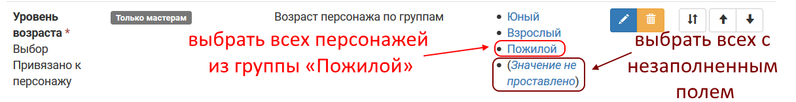

Фильтры по значениям полей
====================================

Поля персонажа типов «выбор» и «мультивыбор» автоматически формируют `специальные группы <http://docs.joinrpg.ru/ru/latest/groups/hidden-group.html#id5>`_, отображающиеся как часть сетки ролей.

	   
Также можно выбрать всех персонажей, у которых это поле не заполнено. Фильтр по незаполненным полям доступен также и для текстовых полей.

Для полей заявки доступен только фильтр по заявкам, у которых поле не заполнено. Специальные группы для полей заявки не формируются, и фильтр в интерфейсе по ним не доступен. 

.. hint:: Воспользуйтесь выгрузкой в эксель, если вам требуется отфильтировать что-либо по полям заявки. 
