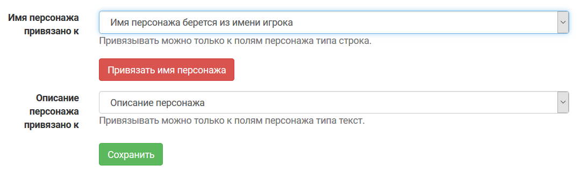

Проекты, существовавшие до релиза 2019.3
==================================================

По умолчанию в проектах, которые существовали до релиза, будет использоваться «классический» режим, при котором имя персонажа не привязано ни к какому полю, а редактируется отдельно, само по себе. Создавать такие проекты после релиза будет  нельзя (но с точки зрения игрока настроенный по умолчанию проект типа «ролевая игра» от «классического» режима ничем не отличается).

Единственное изменение: в списке полей таких проектов появилось «Описание персонажа». Игрокам это поле не доступно, показывается в сетке ролей, как и раньше. Если вам нужно дать игрокам доступ к изменениям описания своего персонажа — просто поменяйте настройки поля. 

Мы рекомендуем привязать имя персонажа к полю (см. ниже): редактирование имени персонажа в заявке будет удобнее, можно будет настраивать права доступа к редактированию (только мастерам или еще и игроку). Если вам удобно так, как работает сейчас — можно оставить как есть.

Изменение настроек
-------------------------------

.. warning:: После привязки поля вернуться в «классический» режим будет нельзя. 

Если у вас конвент — в разделе **Прочее → Поля персонажа / заявки → «Настройки полей»** выберите «Имя персонажа привязано к … Имя персонажа берется из имени игрока» и нажмите кнопку «Привязать имя персонажа». 

Если вы при создании игры выбирали «конвент», скорее всего, это уже сделано.

Для игр: если у вас не было поля «имя персонажа», создайте его (тип: строка, привязка: к персонажу). Если было — используйте готовое. Дальше в разделе **Прочее → Поля персонажа / заявки → «Настройки полей»** выберите «Имя персонажа привязано к … (нужное поле)» и нажмите кнопку «Привязать имя персонажа»

Готово — ваш проект работает в новом режиме. Можете настраивать такой доступ игроков к редактированию сетки ролей, какой требуется вашей игре.

Персонажи, существовавшие до назначения нового поля, будут отображаться в сетке ролей под тем же именем и с тем же описанием, что и раньше. Автоматической замены на значение нового поля для уже существовавших персонажей не произойдет.

При сохранении персонажа после перепривязки имени персонажа к другому полю — имя / описание персонажа в сетке ролей будет заменено на значение нового поля, настроенного в качестве имени / описания персонажа.
