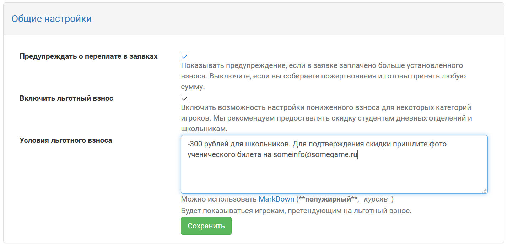
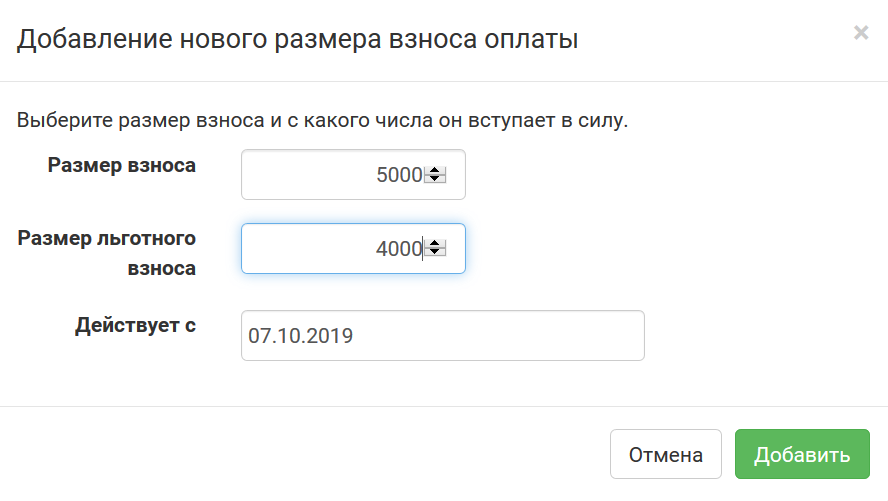
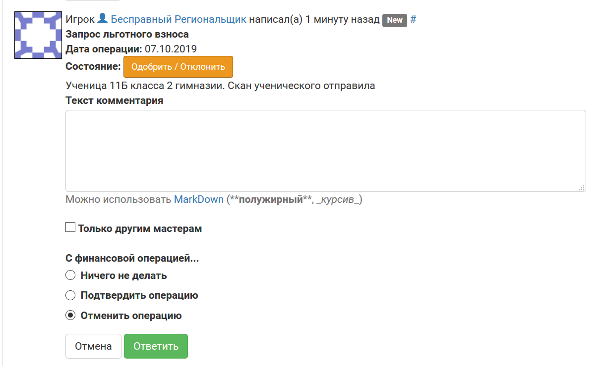

Льготные взносы
=========================

Для некоторых категорий игроков можно принимать пониженные взносы. Мы рекомендуем предоставлять скидку студентам дневных отделений и школьникам.

Чтобы включить возможность запросить льготный взнос для игроков, перейдите **Финансы/АХЧ > Настройка финансов** и выберите пункт **Общие настройки**. Поставьте галочку «Включить льготный взнос» и укажите какие-то условия, при которых он предоставляется. Эти условия будут видны игроку `при нажатии на кнопку «Запросить льготу» в его заявке<http://docs.joinrpg.ru/ru/latest/for_players/discount.html>`_.

	
После этого в разделе **Взносы и сроки** у вас появится возможность установить не только сумму взноса, начинающуюся с какой-то конкретной даты, но и соответствующую ей льготную сумму:

Как и обычная сумма взноса, льготная будет автоматически изменяться со временем в соответствии с заданными вами настройками по датам.

.. attention:: Чтобы настроить льготный взнос — его надо сначала включить в настройках. До этого вы сможете добавлять только обычную последовательность растущего со временем взноса (без возможности льготы).

.. note:: Если вы опцию «Включить льготный взнос» активировали, а сумму льготного взноса не настроили — игрок все еще может запросить льготу из своей заявки. Но сумма к оплате никак не будет измняться после вашего подтверждения. 

Подтверждение запрошенной льготы
---------------------------------------

Уведомления о запросах льготы от игроков приходят всем мастерам, `подписанным на финансовые операции <http://docs.joinrpg.ru/ru/latest/communication/subscriptions.html>`_. Комментарий с запросом льготы появляется в заявке игрока:

	   
Мастеру с доступом к финансовым операциям доступны следующие опции:

* оставить комментарий, ничего не делая с операцией (например, чтобы уточнить что-то у игрока или скрытым комментарием — у других мастеров);
* подтвердить льготу (сумма взноса автоматически изменится к льготной);
* отклонить операцию с комментарием, почему вы не принимаете запрос на льготу.

