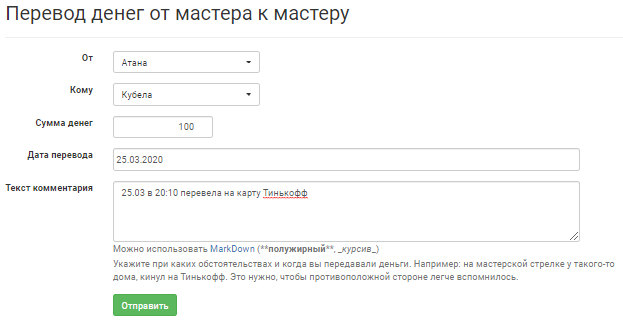

Отметить перевод
================
Внутри мастерской группы часто возникает необходимость передать деньги от мастера (например, если разные мастера принимают взносы или, наоборот, разные мастера тратят деньги). Функционал joinrpg.ru позволяет отмечать такие переводы и учитывать их в сводке по бюджету проекта.
В разделе **Финансы/АХЧ > Отметить перевод** заполните все имеющиеся поля, после чего нажмите «Отправить».

.. hint:: При переводе не забудьте в комментариях указать, при каких обстоятельствах и когда вы передавали деньги. Например: на мастерской стрелке у такого-то дома, кинул на Тинькофф. Это нужно, чтобы противоположной стороне было легче вспомнить.