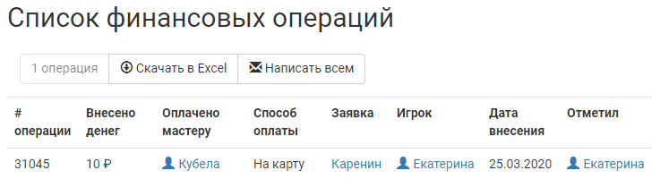
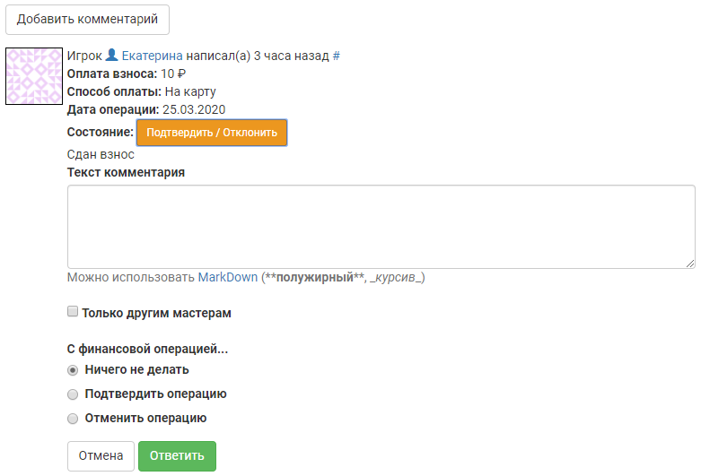

Оповещение мастеров и модерация отметки о сдаче взноса
======================================================
Для удобства разбора платежей многие мастерские группы просят игроков оповещать их через заявку об оплате взноса безналичным или наличным способом. Специально для этого в joinrpg.ru имеется функционал отметки взноса для игроков и механизм его модерации для мастеров.

Отметить оплату
---------------
Игрок может отметить факт сдачи взноса в верхней части своей заявки. Подробно об этом расписано в `Как отметить факт сдачи взноса <https://docs.joinrpg.ru/ru/latest/for_players/inform_about_payment.html>`_.

Оповещение об отметке взноса придет на емейл мастера, за которым закреплена данная заявка, а также подписанным на нее мастерам. 

Подтверждение отмеченного игроком взноса
----------------------------------------
В разделе **Финансы/АХЧ > Взносы - на модерации** можно просмотреть список всех взносов, которые еще не прошли модерацию мастеров, а также выгрузить его в Excel-файл.

Выбрав в таблице нужную заявку и перейдя на страницу с ней, в комментариях мастер увидит возможность изменения статуса отметки о сданном взносе.

Нажатие на «Подтвердить/Отклонить» раскроет дополнительные поля, в которых мастер сможет:

* Оставить комментарий, не изменяя статус платежа (например, «уточните время перевода» и т.п.);

* При желании отправить на емейл другим мастерам информацию об изменении статуса отметки о сданном игроком взносе;

* Подтвердить или отклонить отметку о сданном взносе.

.. hint:: Если у мастера остались вопросы к игроку по поводу переведенного взноса (например, игрок перевел без согласования меньшую или большую сумму), то рекомендуем в поле комментария задать игроку соответствующий вопрос, а в качестве финансовой операции выбрать пункт «Ничего не делать».

Оповещение об изменении статуса взноса придет игроку на емейл.