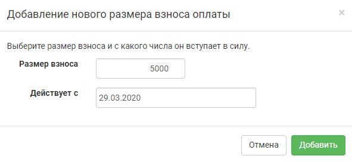
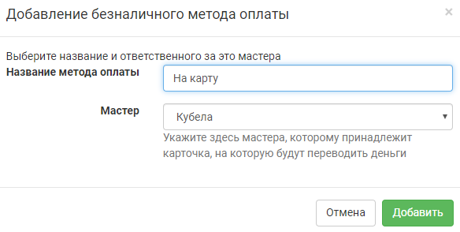
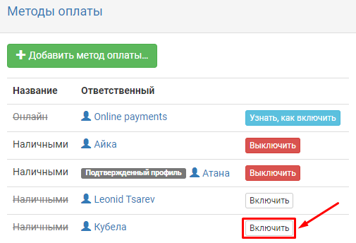
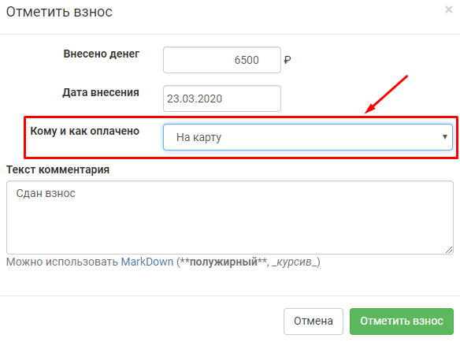

Взнос
================

Настройка размера и срока действия
----------------------------------
Для получения возможности настройки взносов у мастера должны быть проставлены соответствующие `права <https://docs.joinrpg.ru/ru/latest/project/access.html#id3>`_ в разделе **Прочее > Мастера**.

Чтобы задать размер взноса, перейдите в своем проекте: **Финансы/АХЧ > Настройка финансов > Взнос и сроки**. Дальше нажмите «Добавить нужный размер взноса».

В открывшемся окне задайте размер взноса и дату, с которой он будет действовать.

.. attention::

После того, как вы нажмете «Добавить», у вас не будет возможности отредактировать или удалить введенную информацию. Поэтому будьте внимательны.

.. hint::

Если вы все-таки допустили ошибку и добавили некорректный вариант размера или срока действия взноса, то просто создайте новую запись, срок действия которой будет на день позже ошибочной.

Если взнос на ваш проект будет изменяться со временем, вы можете через «добавить нужный размер взноса» указать необходимое количество вариантов.

Методы оплаты
-------------
На joinrpg.ru есть несколько опций приема взносов.

**«Онлайн»** - подробно об этой возможности вы можете прочитать в разделе `Прием платежей онлайн <https://docs.joinrpg.ru/ru/latest/online_payment/index.html>`_.

**«Безналичный метод»** - переводы с карты на карту. Так как разные мастерские группы могут использовать разное количество и виды карт для приема взносов, для указания возможных вариантов безналичной оплаты необходимо воспользоваться кнопкой «Добавить метод оплаты».

В открывшемся окне необходимо ввести название метода оплаты (например, «На карту Сбербанк», «Карта Тинькофф», «Карта ** 1234» и т.п.) и из списка мастеров выбрать того, кому принадлежит карта.

.. hint:: Название безналичного метода оплаты должно быть уникальным и понятным игроку, чтобы при отметке им взноса не возникло ошибок. Например, «Сбербанк 1» и «Сбербанк 2» - это плохой пример названий для методов оплаты. А «Сбербанк ** 1234 Скракан» и «Сбербанк ** 9876 Лео» - хороший.

**«Наличными»** - данный метод оплаты требует подключения в явном виде для каждого из мастеров, добавленных в проект. Для этого необходимо в Методах оплаты нажать «Включить» рядом с именем соответствующего мастера.

Указанные вами методы оплаты будут видны игроку в его заявке в «Отметить оплату».

