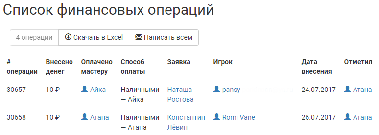

Статистика по взносам
=====================
В процессе работы с бюджетом игры может понадобиться сводная информация по взносам. В joinrpg.ru есть несколько готовых решений для удобства мастеров.

Список всех взносов
-------------------
Просмотреть список всех сданных взносов, выгрузить его в Excel-файл и осуществить массовую рассылку писем на емейл сдавшим взнос игрокам можно в разделе **Финансы/АХЧ > Взносы - все**.

Неоплаченные принятые заявки
----------------------------
В разделе **Финансы/АХЧ > Неоплаченные принятые заявки** мастер может получить список заявок, которые находятся в статусах «Принята» или `«Игрок заехал» </checkin/index.html>`_, но при этом взнос игроком не сдан. Также имеется возможность скачать данный список в Excel-файл или же осуществить массовую рассылку писем на емейл соответствующих игроков.

..  note:: Так как список таких игроков на полигоне может интересовать мастеров по АХЧ в первую очередь, на странице имеется возможность сразу же отправить на печать список неоплаченных принятых заявок.

Оплаченные отклоненные заявки
-----------------------------
В разделе **Финансы/АХЧ > Оплаченные отклоненные заявки** мастер может получить список заявок, которые находятся в статусе «Отклонена», но при этом взнос игроком сдан. Также имеется возможность скачать данный список в Excel-файл, отправить его на печать или же осуществить массовую рассылку писем на емейл соответствующих игроков.

..  note:: Как правило, данный раздел может понадобиться в том случае, если на вашем мероприятии допускается перезачет взносов. При помощи этой готовой выборки вы сможете, например, быстро получить список игроков, которые к вам не поедут, но взнос уже сдали.