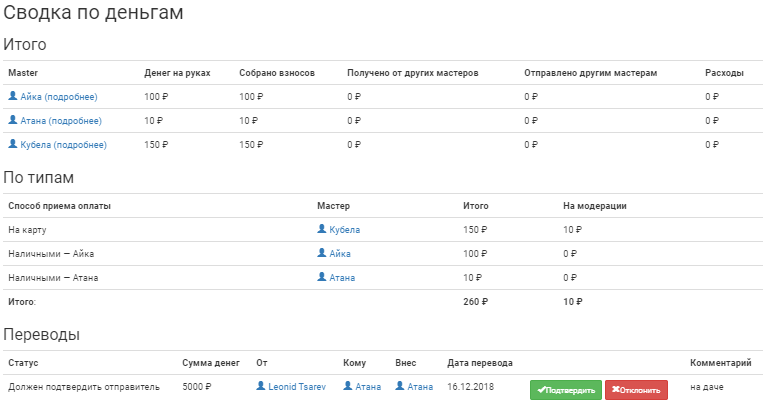

Сводка по деньгам
=================
Так как зачастую в проекте существует несколько способов приема взносов, встает вопрос о том, как удобно отслеживать потоки денежных средств, находящихся на руках или картах мастеров. Раздел **Финансы/АХЧ > Сводка по деньгам** будет особенно полезен тем, кто занимается бюджетом мероприятия. Здесь имеется возможность:

* получить информацию о том, сколько денег находится на руках у того или иного мастера (из списка тех, для кого настроена возможность приема взносов);
* просмотреть статистику по сданным взносам всеми настроенными для игры способами;
* увидеть список переводов между мастерами, а также подтвердить или отклонить их. Подробнее об этом в **Отметить перевод**.

