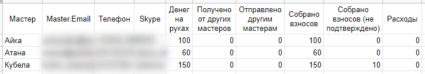

Синхронизация с GoogleDocs
==========================
Для тех мастерских групп, которые ведут свой бюджет в Google Таблицах, существует возможность синхронизировать данные с joinrpg.ru. В любой ячейке (например, А1) введите специальную строку вида
::

=IMPORTDATA("https://joinrpg.ru/ID_ПРОЕКТА/money.csv/summarybymaster/СЕКРЕТНЫЙ_КЛЮЧ")

ID_ПРОЕКТА - это ID вашего мероприятия в базе joinrpg.ru (его вы всегда можете увидеть в адресной строке), а СЕКРЕТНЫЙ_КЛЮЧ - автоматически сгенеренный ключ.

Корректно заполненную строку для вашего проекта вы найдете в разделе **Финансы/АХЧ > Настройка финансов > Синхронизация с GoogleDocs**. 

.. hint:: Для удобства рекомендуем для синхронизации данных с joinrpg.ru создать в вашей Google Таблицы отдельную вкладку.

.. attention:: Учтите, что обновление происходит с некоторой задержкой (раз в несколько часов). Подробности можно узнать в справке `Google Таблиц <https://support.google.com/docs/answer/3093335?hl=ru>`_.