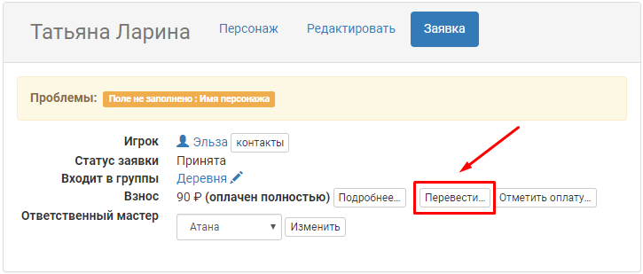
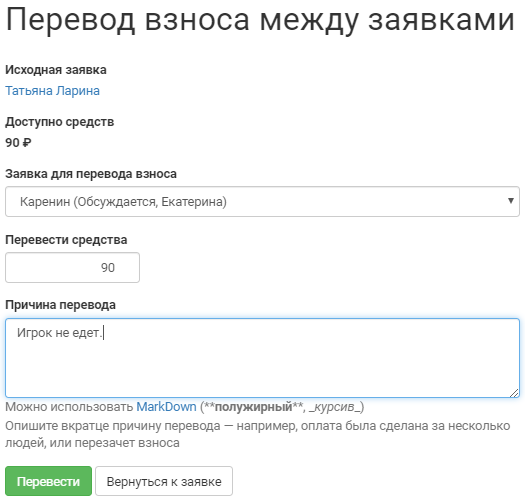

Перезачет взносов
=================
На многих проектах допускается перезачет сданных взносов. Это означает, что если сдавший взнос игрок не сможет поехать на игру, то его взнос можно перезачесть другому игроку. Функционал joinrpg.ru позволяет отметить подобную операцию. Сделать это можно через заявку игрока, взнос которого требуется «передать» другому игроку.

В открывшемся окне заполните все поля, обязательно указав заявку, на которую будет переведен сданный взнос.

..  note:: Можно перезачесть только подтвержденный мастером взнос.

..  note:: Можно перезачесть как целый взнос, так и его часть (например, если у игрока, на которого «переводится» взнос, часть средств уже сдана).

.. attention:: Обязательно фиксируйте в правилах все возможные моменты с возвратом и перезачетом взносов. Описав заранее условия возможного перезачета, вы обезопасите себя от претензий игроков.
