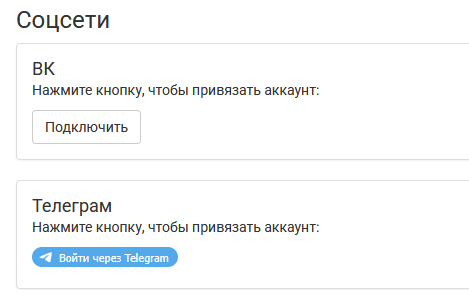
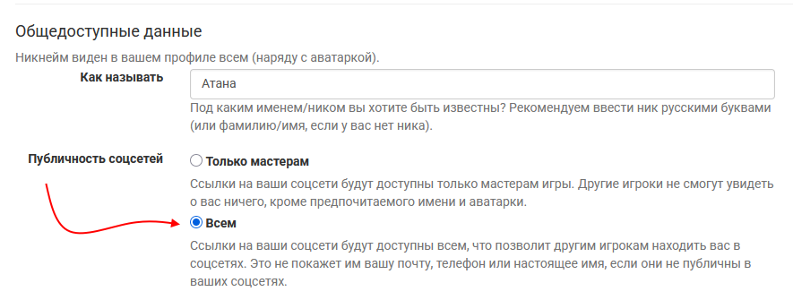
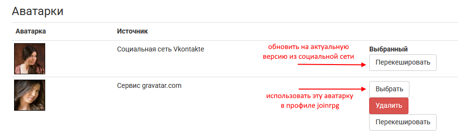

Контакты и аватарка в профиле
==============================

В `вашем профиле <https://dev.joinrpg.ru/manage/setupprofile>`_ есть информация о том, как мастерам с вами связаться. Контакты всегда видны мастерам активных проектов, на которые у пользователя есть неотозванная и неотклоненная заявка. Социальные сети требуется привязать через интерфейс (если вы этого еще не делали и у вас просто внесенные в текстовые поля контакты — советуем привязать):

Можно сделать контакты общедоступными. Тогда другие игроки смогут легче вас опознать и связаться с вами без помощи мастеров. 

.. hint:: `Через вводные <https://docs.joinrpg.ru/ru/latest/plot/special.html>`_ мастера могут показывать контакты игроков друг другу, даже если в профиле они скрыты. Эти контакты также скрываются после закрытия проекта.

Советуем установить аватарку: она подтягиватеся из ВКонтакте или Телеграма при привязке вашего аккаунта.

Если вы привязывали Вконтакте или Телеграм уже давно — нажмите в профиле «Отвязать» и осуществите привязку заново. Если аватарка в соцсетях обновилась и хочется обновить ее и в joinrpg — нажмите «Перекешировать».
