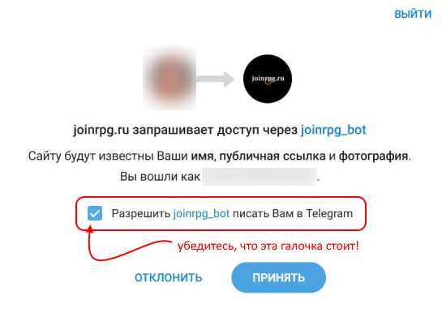

Настройки профиля
==============================

Контакты
------------------

В `вашем профиле <https://joinrpg.ru/manage/setupprofile>`_ есть информация о том, как мастерам с вами связаться. Контакты всегда видны мастерам активных проектов, на которые у пользователя есть неотозванная и неотклоненная заявка. Социальные сети требуется привязать через интерфейс (если вы этого еще не делали и у вас просто внесенные в текстовые поля контакты — советуем подтвердить привязку):

.. figure:: add_social.png
       :align: center
       :alt: Привязать контакты к профилю

Можно сделать ссылки на социальные сети (ВКонтакте, Телеграм и ЖЖ)  общедоступными. Тогда другие игроки смогут легче вас опознать и связаться с вами без помощи мастеров. 

.. figure:: contacts.png
       :align: center
       :alt: Публичность контактов

.. hint:: `Через вводные </plot/special.html>`_ мастера могут показывать контакты игроков друг другу, даже если в профиле они скрыты. Эти контакты также скрываются после закрытия проекта.

Уведомления в Телеграм 
-----------------------

Привязывая Телеграм, поставьте галочку с разрешением сообщений от @joinrpg_bot (этот экран появится после того, как сервисный аккаунт Телеграм предложит вам подтвердить факт логина на сайте и вы с этим согласитесь):

Теперь раз в день вам будет приходить список ваших заявок, которые были изменены или откомментированы мастерами.

Аватарка 
-----------------------

Советуем установить аватарку: она подтягиватеся из ВКонтакте или Телеграма при привязке вашего аккаунта.

.. figure:: avatars.png
       :align: center
       :alt: Установить или обновить аватарку

Если вы привязывали ВКонтакте или Телеграм уже давно — нажмите в профиле «Отвязать» и осуществите привязку заново. Если аватарка в соцсетях обновилась и хочется обновить ее и в joinrpg — нажмите «Перекешировать».
