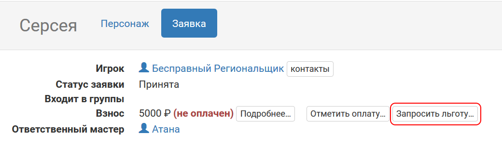
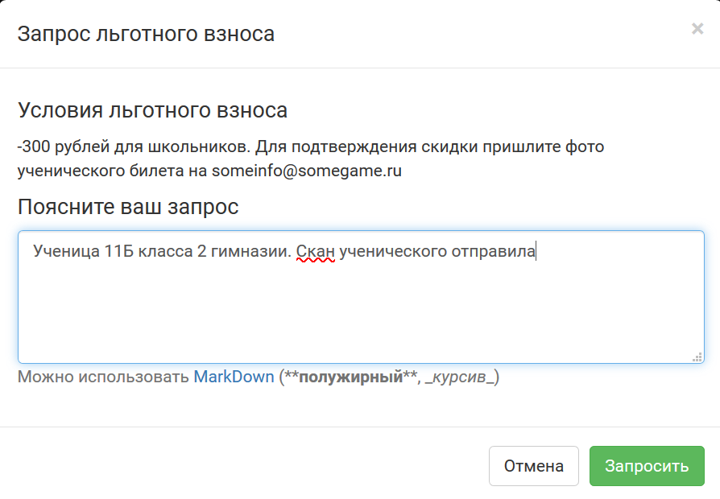
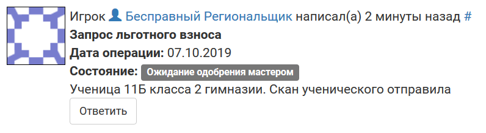

Как запросить скидку на взнос
=================================

В некоторых проектах настроена возможность запросить льготу — пониженный взнос для определенных категорий игроков. Если такая опция предусмотрена мастерами, то рядом с суммой взноса и кнопкой `«Отметить оплату» </for_players/inform_about_payment.html>`_ есть еще одна кнопка, «Запросить льготу»:

После этого откроется меню, в котором можно подробнее узнать, при каких условиях мастера предоставляют скидки на взнос, и отправить запрос на предоставление льготы, если вы подходите под эти условия: 

	   
В вашей заявке появится комментарий с текстом, который вы написали в качестве пояснения к запросу льготы:

	   
Теперь мастер должен подтвердить ваш запрос (и тогда сумма автоматически изменится на установленную для проекта льготную в этом периоде) или отклонить (тогда ничего не произойдет).
