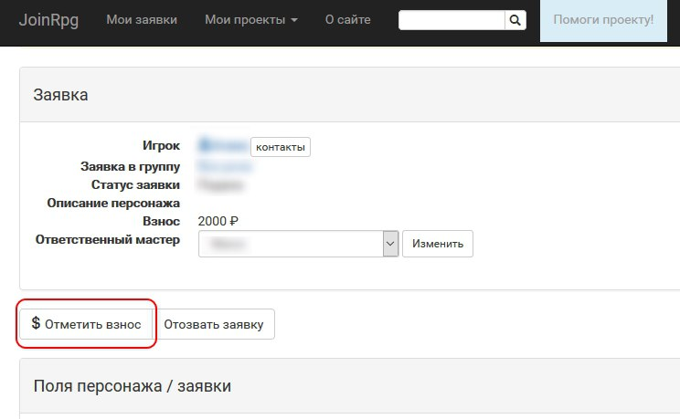
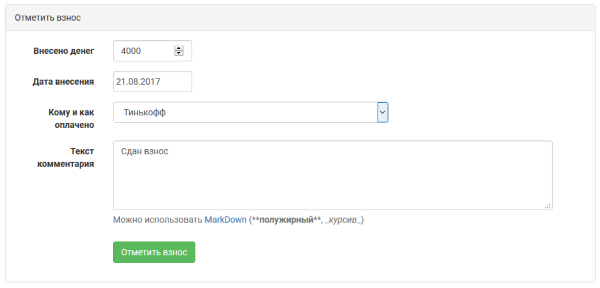
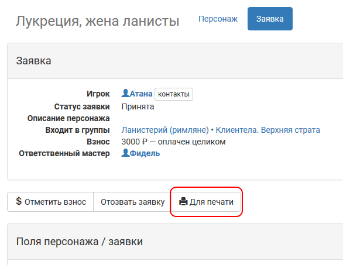

Полезно игрокам
============

В первую очередь JoinRPG облегчает мастерскую работу, но есть несколько фич, которые будут полезны и игрокам.

Как отметить факт сдачи взноса
----------------------------------------
    
Отмечая взнос в заявке, игрок оставляет информацию для мастера, который принял взнос, и для службы АХЧ, а также заметку «себе на будущее» на случай путаницы. Сдав взнос, зайдите в свою заявку и выберите «Отметить взнос». Через какое-то время мастера подтвердят, что всё ОК.

Форма сдачи взноса включает:

* сумму, которую перевел / передал игрок;
* дату (по умолчанию — сегодня, не забывайте ставить правильно, если отмечаете задним числом);
* куда были переведены деньги (способы настраиваются мастерами);
* комментарии (сюда можно написать любые замечания, которые касаются обстоятельств передачи денег или размера суммы: «отдал на Комконе во время семинара», «взнос снижен по согласованию с мастером по АХЧ Боромиром», — всё, что помоежт потом разобраться в бухгалтерии).

.. attention:: Отмечайте **только свой взнос**. Если вы переводили «за себя и того парня», пусть «тот парень» отметит в своей заявке сам с комментарием вроде «перевод вместе с Эарендилем» (это снизит путаницу при работе АХЧ).

.. hint:: Если нужного вам способа нет в списке способов — может быть, вы что-то делаете не так. Не имея стопроцентной уверенности, лучше еще раз уточнить: например, многие мастерские группы не принимают взносы наличными, а региональный мастер мог об этом забыть.

Как распечатать свою заявку
----------------------------------------

Хотя некоторые мастерские группы готовят для игроков конверты с раздаткой и всеми важными материалами, которые были в заявке, нередко хотелось бы самим распечатать материалы из заявки — на всякий случай, чтобы прочитать в электричке или освежить память перед игрой.
Для этого в каждой своей принятой заявке каждому игроку доступна функция «Для печати», которая форматирует вашу заявку в формат, привычный нам по раздаткам — поля персонажа и все его загрузы (если есть). Распечатайте как pdf или на бумаге, возьмите с собой на телефоне или планшете как файл на полигон или на встречу с мастерами!

.. attention:: Обратите внимание, что в распечатку попадут только поля персонажа (не информация из заявки), помеченные мастерами как «включать в распечатки».

Как восстановить отозванную заявку
----------------------------------------

Если вы уже заявлялись, но потом передумали ехать и отозвали заявку (или если мастер отклонил ее по вашей просьбе), то при желании повторно заявиться на ту же игру может быть полезно восстановить вашу старую заявку. Наверняка вы уже что-то писали о своих пожеланиях, возможно, даже заполняли какие-то поля. 
Просто попросите мастера восстановить вашу заявку в комментариях (комментарии можно оставлять даже в неактуальной заявке).

.. attention:: Восстановить заявку можно только в том случае, если бы вы могли бы на свое «старое место» заявиться заново: для неутвержденной заявки в группу — должен оставаться открытым прием заявок, кроме приписанных в сетке; для заявки на роль — роль не должна иметь принятой заявки.