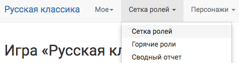
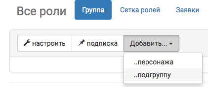
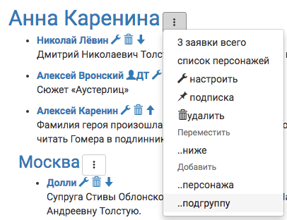

## Создание и настройка групп персонажей

Создавайте группу персонажей каждый раз, когда вам кажется, что вам может потребоваться показывать им общую вводную (информационную или закрытые правила), считать их число (например, лимит всех вампиров на игре) или делать по ним рассылку (например, предупредить всех военных, чтобы везли каски).
Вы можете это делать как на этапе проектирования сетки ролей, так и в процессе работы над игрой. 

**Меню → Сетка ролей → Группа → Добавить → ...подгруппу**

 Если вы хотите создать подгруппу в уже имеющейся группе, то достаточно нажать на три точки у названия и выбрать «Добавить → ...подгруппу» там.

Для каждой группы можно настроить:
* **группы, частью которых она является** — например, группа «Вампиры» войдет в группу «Мистические создания» и «Мертвые персонажи»;
* **ответственного мастера** — все новые заявки в эту группу будут закрепляться за ним, ответственный мастер всегда получает email-уведомления своих заявок вне зависимости от того, как у него настроены уведомления;

 Ответственный мастер по настройкам группы автоматически назначается только новым заявкам. Для уже поданных и/или принятых переназначить можно только вручную, для каждой заявки в отдельности.

* **видимость** (публичность) — будет ли эта группа видна в сетке ролей или доступна только мастерам: например, можно создать непубличную группу «нильфгаардские шпионы» и добавить в нее всех, кто работает на нильфгаардскую разведку по всем северным королевствам;
* **возможность заявляться вне прописанной сетки ролей** можно запретить (нам нужны в этой локации только задуманные мастерами персонажи), разрешить определенное число (нам нужен Дарт Вейдер и еще до 5 штурмовиков, про которых пока ничего неизвестно) или без указанного лимита (мы примем столько заявок «боец армии Нильфгаарда», сколько подаст заявку).
