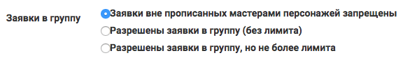

Создание группы 
================

Создавайте группу персонажей каждый раз, когда вам кажется, что вам может потребоваться показывать им общую вводную (информационную или закрытые правила), считать их число (например, лимит всех вампиров на игре) или делать по ним рассылку (например, предупредить всех военных, чтобы везли каски).

Вы можете это делать как на этапе проектирования сетки ролей, так и в процессе работы над игрой. 

.. note:: В некоторых случаях будет удобнее пользоваться `специальными группами <http://docs.joinrpg.ru/ru/latest/groups/hidden-group.html#id5>`_, создающимися автоматически при заполнении полей персонажа.

**Меню → Сетка ролей → Группа → Добавить → ...подгруппу**

.. figure:: group-menu.png
       :scale: 100 %
       :align: center
       :alt: Создание групп персонажей

.. figure:: group-menu-create.png
       :scale: 100 %
       :align: center
       :alt: Создание групп персонажей

.. hint:: Если вы хотите создать подгруппу в уже имеющейся группе, то достаточно нажать на три точки у названия и выбрать «Добавить → ...подгруппу» там.

Настройка группы
----------------

.. figure:: group-create-group.png
       :scale: 100 %
       :align: center
       :alt: Настройка групп персонажей

Для каждой группы можно настроить:

* **группы, частью которых она является** — например, группа «Вампиры» может войти в группы «Мистические создания» и «Мертвые персонажи»;
* **ответственного мастера** — все новые заявки в эту группу будут закрепляться за ним, ответственный мастер всегда получает email-уведомления своих заявок вне зависимости от личных настроек;

.. note:: Ответственный мастер по настройкам группы автоматически назначается новым заявкам. Для уже поданных и/или принятых переназначить можно только вручную, для каждой заявки в отдельности.

* **видимость** (публичность) — будет ли эта группа видна в сетке ролей или доступна только мастерам: например, можно создать непубличную группу «нильфгаардские шпионы» и добавить в нее всех, кто работает на нильфгаардскую разведку по всем северным королевствам. [Подробней о непубличных группах](#);
* **возможность заявляться вне прописанной сетки ролей**:
	- Можно запретить. Например, если в этой локации нужны только конкретные персонажи; 
	- Разрешить определенное число. Например, нужен Дарт Вейдер и еще до 5 штурмовиков, про которых пока ничего неизвестно;
	- Без указанного лимита. Например, примем столько заявок «боец армии Нильфгаарда», сколько подаст заявку.

С помощью настройки «Заявки в группу» можно закрывать заявки в конкретные группы. Для этого достаточно, после принятия в группу всех нужных заявок, отметить в настройках группы «Заявки в группу → Заявки вне прописанных мастерами персонажей запрещены»

