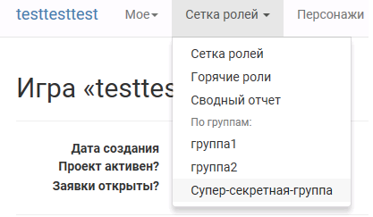
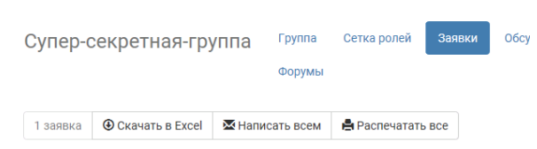
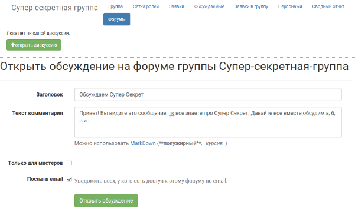
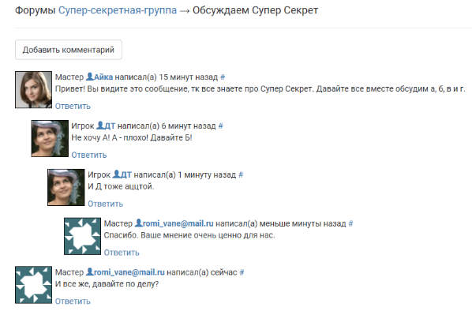
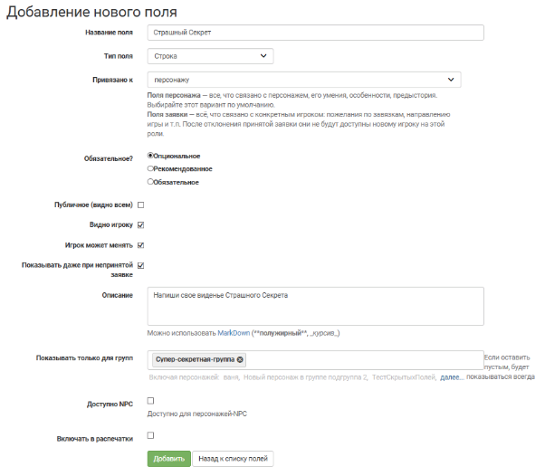

# Скрытые группы

Нередко для упрощения мастерского труда необходимы скрытые от игроков группировки заявок/персонажей. 
*Например, внутри школы Хогвартс, кроме явной группировки детей по факультетам, так же нужны объединения игроков по политическим предпочтениям — кто за Пожирателей Смерти, а кто за Орден Феникса.*

База joinrpg.ru умеет создавать скрытые группы и объединять в них нужных персонажей. С этими скрытыми группами можно впоследствии выполнять все те же функции что и с обычными группами — делать рассылку, подписываться на уведомления, создавать общие сюжеты, поля заявки, форумы, делать выгрузку в эксель и тд.

Подобные скрытые группы можно создать двумя путями: через добавление группы и через автоматический процесс создания спец. группы на основе заполнения полей.

## Добавление группы

**Меню → Сетка ролей → Все роли → Группа → Добавить → ..подгруппу**

### Заполнение полей группы

*Если группа нужна для работы внутри МГ (консолидация игроков для рассылок, подписка на конкретных игроков, форум), то снимите галочку «публично».*

 Обратите внимание что при заполнении поля «Является частью групп», не обязательно искать нужную группу из списка. Для поиска достаточно начать вводить ее название.

### Добавление персонажей в группу

Для того чтобы добавить персонажа в группу, надо:
- зайти в каждого персонажа (*или уже имеющуюся группу*), 
- нажать «редактировать»,
- найти поле «является частью групп»,
- начать вводить в этом поле название группы,
- выбрать поле из появившегося списка (*если группа не ищется, но точно существует — попробуйте сменить браузер*),
- сохранить.

На странице персонажа непубличные группы будут выделены серым фоном.
*Все что находится на сером фоне игрокам не видно!* 

 Добавлять в группы можно только персонажей. Если заявка не принята на конкретного персонажа, то присвоить ей скрытую группу не получится.

 В уже созданную группу всегда можно добавить/удалить еще персонажей/групп.

## Автоматическое создание спец. группы

Спецгруппы создаются автоматически на основе полей типа «выбор» и «мультивыбор». Они отображаются внизу общей сетки ролей и помечены символом «спецгруппа».

В примере на скриншоте ниже «Раса» — поле, а «человек», «вампир» и «призрак» — варианты ответов. 

## Манипуляции с непубличной группой

После того как группа создана и в нее добавлены игроки она считается готовой. С этого момента по группе можно делать рассылки (уйдут всем игрокам входящим в группу), создавать форумы, публиковать сюжеты, создавать поля заявки/персонажа видимые только этой группе, подписываться на уведомления. 

### Рассылка по игрокам группы
**Меню → Сетка ролей → нужная группа → Заявки → Написать всем**

После отправки рассылки, откроется страничка на которой написано что «рассылка поставлена в очередь». Это означает что она уходит прямо сейчас. Для больших проектов рассылка может занять до 5 минут времени.

### Подписка на уведомления
**Меню → Сетка ролей → нужная группа → Группа → Подписка → отметить галочками нужные уведомления → Сохранить**

### Форумы
Форумы это новый инструмент. Аналогичен чатикам в ВК, только в джойне.

**Меню → Сетка ролей → нужная группа → Форумы → открыть дискуссию**

### Сюжеты
Сюжеты создаются в отдельной ветке «сюжеты» и любую из имеющихся групп можно на них подписать.
Подробней смотрите главу [«Сюжеты»](http://docs.joinrpg.ru/ru/latest/plot/index.html).

### Поля заявки
Можно создать поля заявки/персонажа видимые только персонажам состоящим в этой группе. 

**Меню → Прочее → поля заявки / персонажа → Добавить новое поле** 

Заполнить поля соответственно нуждам МГ и обязательно прописать в разделе *«показывать только для групп»* нужную группу.

 Обратите внимание что при заполнении поля «Является частью групп», не обязательно искать нужную группу из списка. Для поиска достаточно начать вводить ее название.

