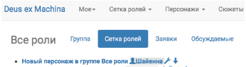
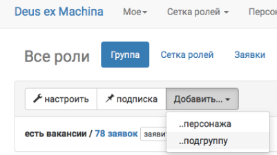
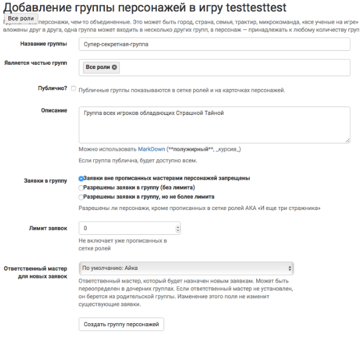
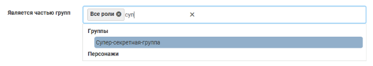
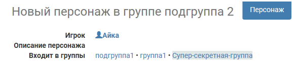
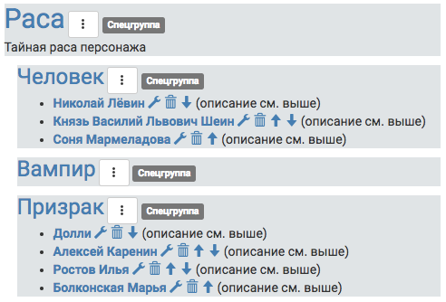

Скрытые группы
===============
Нередко для упрощения мастерского труда необходимы скрытые от игроков группировки заявок/персонажей. 
*Например, внутри школы Хогвартс, кроме явной группировки детей по факультетам, также нужны объединения игроков по политическим предпочтениям — кто за Пожирателей Смерти, а кто за Орден Феникса.*

База joinrpg.ru умеет создавать скрытые группы и объединять в них нужных персонажей. С этими скрытыми группами можно впоследствии выполнять все те же функции что и с обычными группами — делать рассылку, подписываться на уведомления, создавать общие сюжеты, поля заявки, форумы, делать выгрузку в эксель и тд.

Подобные скрытые группы можно создать двумя путями: через добавление группы и через автоматический процесс создания спец. группы на основе заполнения полей.

Добавление группы
------------------
**Меню → Сетка ролей → Все роли → Группа → Добавить → ..подгруппу**

Заполнение полей группы
------------------------
*Если группа нужна для работы внутри МГ (консолидация игроков для рассылок, подписка на конкретных игроков, форум), то снимите галочку «публично».*

.. hint:: Обратите внимание, что при заполнении поля «Является частью групп» не обязательно искать нужную группу из списка. Для поиска достаточно начать вводить ее название.

Добавление персонажей в группу
------------------------------
Для того чтобы добавить персонажа в группу, надо:

- зайти в каждого персонажа (*или уже имеющуюся группу*), 
- нажать «редактировать»,
- найти поле «является частью групп»,
- начать вводить в этом поле название группы,
- выбрать поле из появившегося списка (*если группа не ищется, но точно существует — попробуйте сменить браузер*),
- сохранить.

На странице персонажа непубличные группы будут выделены серым фоном.
*Все что находится на сером фоне игрокам не видно!* 

.. attention:: Добавлять в группы можно только персонажей. Если заявка не принята на конкретного персонажа, то присвоить ей скрытую группу не получится.

.. note:: В уже созданную группу всегда можно добавить/удалить еще персонажей/групп.

Автоматическое создание специальных групп
------------------------------------------
Спецгруппы создаются автоматически на основе полей типа «выбор» и «мультивыбор». Они отображаются внизу общей сетки ролей и помечены символом «спецгруппа».

В примере на скриншоте ниже «Раса» — поле, а «человек», «вампир» и «призрак» — варианты ответов. 

.. note:: Спецгруппы нельзя привязывать к другим группам как дочерние, но все остальные операции (рассылки, присвоение вводных или показ определенных полей персонажа) с ними доступны.

