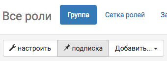
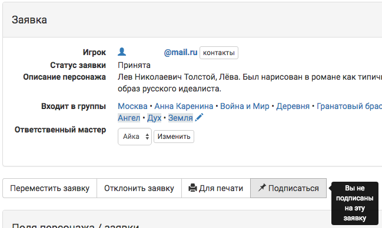

Настройка уведомлений
======================
Уведомления о новых комментариях в заявках, где вы назначены ответственным мастером, будут всегда приходить вне зависимости от ваших настроек. Но вы можете подписаться на уведомления для любого числа групп. 
Если вы хотите получать вообще все уведомления проекта - подпишитесь на группу «Все роли».
Если вас интересует разрозненные персонажи - объедините их в `скрытую группу <http://docs.joinrpg.ru/ru/latest/groups/hidden-group.html?`_ и подпишитесь на нее либо подпишитесь на каждого персонажа в отдельности.

Подписка на группу
-------------------
**Меню → Сетка ролей → Группа → Подписка**

Или нажмите кнопку тремя вертикальными точками рядом с названием группы, на изменения в заявках которой вы бы хотели подписаться, и выберите пункт «подписка».

.. figure:: group-notification2.png
       :scale: 100 %
       :align: center
       :alt: Настройка уведомлений

В настоящий момент можно получать уведомления о следующих событиях:

* подаче новых заявок и изменении их статуса (прием / отклонение),
* новых комментариях,
* финансовых операциях,
* изменениях открытых полей

Возможно подписаться на уведомления о разных событиях для разных групп. Например, если региональный мастер Аэдирна также отвечает за прием взносов, то он может быть подписан на комментарии и новые заявки / изменение статуса в его локации, Аэдирне, а также — на финансовые операции всех ролей.  

Подписка на заявку
-------------------
Кроме группы можно подписаться на конкретную заявку. 
Для этого зайдите в заявку и выберите «подписаться». 

Уведомления о комментариях
---------------------------
Уведомления о комментариях всегда приходят вне зависимости от ваших личных настроек только в двух случаях:

* вы — ответственный мастер этой заявки;
* игрок отвечает на оставленный вами комментарий.

.. attention:: Во втором случае никакие другие уведомления с этой заявки (новые комментарии в других ветках, ответы на комментарии других мастеров в этой же ветке и т.п.) приходить вам не будут.
