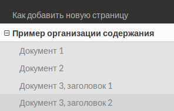
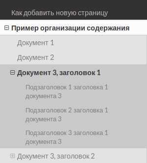

# Организация документации
## Как добавить новую страницу

Документация организовывается, как и многое другое, из *файлов* и *каталогов*.

*Файлы* могут быть написаны как на [_markdown_](https://github.com/adam-p/markdown-here/wiki/Markdown-Cheatsheet), так и на [_reStructuredText_](https://ru.wikipedia.org/wiki/ReStructuredText). Документы будут трактоваться совершенно одинаково на любом из этих двух форматов.

Для организации документации в каждом формате есть *заголовки* разных уровней. Они при компиляции документации выстроятся в удобное Оглавление.

Таким образом, весь набор документации &nbsp; это набор файлов. Каждый файл при компиляции станет отдельной страницей HTML.

## Построение оглавления

В каждом *каталоге* может (не обязан) находиться файл `index.rst` (в формате [_reStructuredText_](https://ru.wikipedia.org/wiki/ReStructuredText)).
В файле `index.rst` прописывается *содержание* документации данного *каталога*. Логично, если документация *каталога* ниже уровнем имеет какую-то ссылку из документации выше уровнем.

Для наглядного примера есть [пример](sample/)

Например, *каталог* содержит файлы с документацией `doc1.md`, `doc2.md` и `doc3.md`. Тогда содержимое файла `index.rst` будет примерно такое:

```
Большой заголовок каталога
==========================

Тут можно написать какой-то текст, чтобы не было только содержание.

.. toctree::

    doc1
    doc2
    doc3
```

При этом строчка `.. toctree::` магическая в *reStructuredText*, вот так и надо оставлять. Под ней после пустой строчки следуют названия *файлов* **без расширения**.

В содержание попадут все заголовки верхних двух уровней в каждом *файле*. При этом второй уровень будет виден только для текущего файла.

В примере документы doc1.md и doc2.md имеют по одному заголовку, тогда как doc3.md имеет два заголовка и несколько подзаголовков.


Вот так выглядит Оглавление для общей страницы:


Если же перейти на страницу `doc3`, то будут видны подзаголовки:




