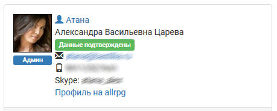

Подтверждение профиля
==================================================

На нашем сайте есть возможность пройти проверку и подтверждение профиля. Мы проверяем действительность:

1. Фамилии, имени, отчетства
2. Телефона

После подтверждения данных появится соответствующая отметка в профиле.

Зачем это нужно
-------------------
Подтверждение профиля необходимо для онлайн приема-платежей. Все пользователи, у которых есть права финансового администратора на проекты, к которым подключен прием платежей «онлайн», должны пройти проверку. В дальнейшем мы можем требовать или рекомендовать верификацию еще в каких-то случаях.

Нужно ли проходить проверку профиля, чтобы заявляться на игры?
---------------------------------------------------------------------------------------------------------------
Нет. Мастера не имеют права требовать подтверждение профиля от игроков.

Как пройти подтверждение профиля
-----------------------------------------------
Заполните ФИО и телефон у себя в профиле.
Напишите письмо на support@joinrpg.ru с текстом:

	*Я, Иванов Иван Иванович, прошу подтвердить мой профиль на джойнрпг (ссылка). Обязуюсь не передавать доступ к профилю третьим лицам.*

Приложите к письму фотографию себя с любым документом, выданным государством, с фотографией и полными ФИО. Годятся: паспорт, права, загранпаспорт. Не годятся: студенческий, пропуск на работу (выдан не государством), свидетельство о рождении.

Будьте готовы ответить на SMS или звонок (через какое-то время).

Администрация сайта оставляет за собой право проводить дополнительные проверки, отказывать в подтверждении по своему усмотрению и т.д.

Ограничения на подтвержденный профиль
---------------------------------------------------------------

* Запрещается предоставлять доступ к подтвержденному профилю третьим лицам. 
* В случае изменения ФИО или номера телефона необходимо уведомить техподдержку.
* Самостоятельно менять подтвержденные данные нельзя.
