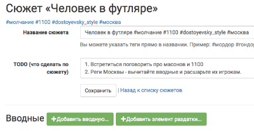
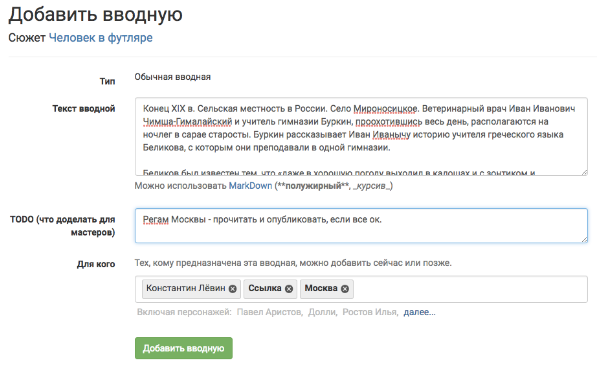
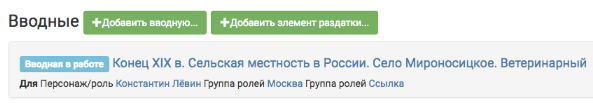
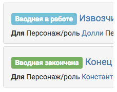
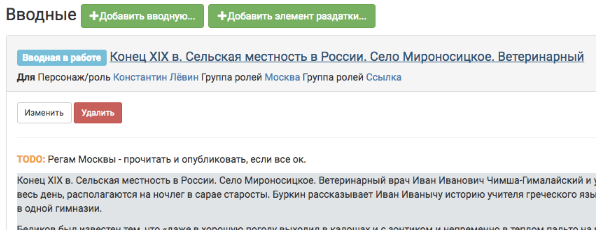
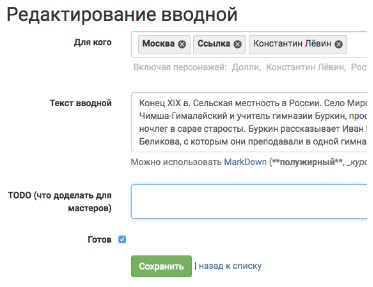
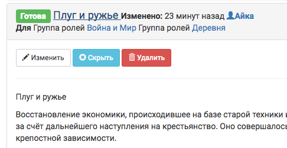
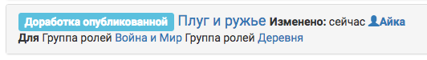
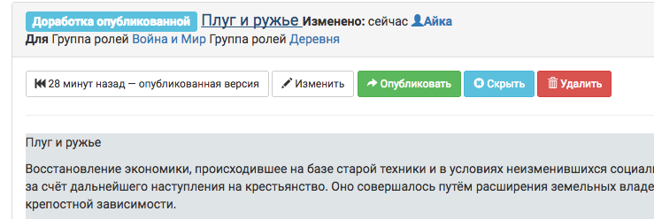

Вводная
================

Cоздание вводной
----------------------
Чтобы создать вводную, после создания сюжета на его странице нужно нажать «добавить вводную».
После добавления вводная будет доступна только для мастеров до тех пор, пока мастера ее не опубликуют.
Вводных в сюжете может быть сколько угодно.

Поля страницы вводной
----------------------
На странице добавления вводной нужно заполнить поле **«текст вводной»**. Это обычно текстовое поле, в которое для выделения полужирным/курсивом или вставки ссылок и картинок может использоваться `разметка Markdown <http://commonmark.org/help>`_. ::

    .jpg) 

.. hint:: Советуем использовать для вводных подзаголовки, т.к. вводные автоматически получают название по первой строчке текста. Это удобно и для представления вводных для игроков: хотя для мастера все вводные персонажа разделены элементами управления, `для игроков они представляются единым текстом <http://docs.joinrpg.ru/ru/latest/plot/other.html#id4>`_.

.. attention:: Загрузить картинку напрямую на сайт базы заявок не получится, но можно показать ее с помощью `разметки Markdown <http://commonmark.org/help>`_ при условии, что она где-то выложена и вы знаете url. Обратите внимание, что картинка показывается «как есть», без возможности указать желаемую ширину.

**Поле «TODO»** соответствует аналогичному `полю у сюжетов <http://docs.joinrpg.ru/ru/latest/plot/creating-plot.html#todo>`_.

И, наконец, **поле «для кого»**. В это поле можно добавить как персонажей, так и группы персонажей, причем делать это сразу на этапе создания вводной не обязательно. Даже после ее публикации вводную можно будет расшарить новым добавленным персонажам (или группам).

После того как вводная добавлена, на странице сюжета она выглядить так:

Статусы вводной
----------------
«Вводная в работе» - означает, что она не готова и не опубликована игрокам.

«Вводная закончена» - означает, что она готова и что проставленные в поле «для кого» игроки ее видят в своей заявке.

«Доработка опубликованной» - означает, что она была опубликована и игроки видят ее опубликованную версию, но мастера вносят в нее дополнительные изменения не видимые игрокам.

       

Публикация вводной 
---------------------
Для того чтобы опубликовать вводную, надо:

1. Нажать на название вводной.
2. Выбрать «Изменить».

3. Удостовериться что все пункты из TODO выполнены. 
4. Поставить галочку в поле «готов».
5. Нажать «сохранить».

С этого момента вводная приобрела статус «вводная закончена» и видна игрокам.

Тем не менее, ее все еще можно редактировать, добавлять или удалять персонажей, которым эта вводная доступна.

Редактирование вводной
---------------------------

Отредактировать вводную можно в любой момент. Как после ее сохранения, так и после ее публикации игрокам. 

Для того чтобы отредактировать вводную, нажмите на название вводной. После этого «развернутся» текст вводной и кнопки управления. Начать редактировать вводную можно по кнопке **«изменить»**.

.. hint:: Если текст вводной на сером фоне - значит она еще не опубликована игрокам.

У уже **опубликованной вводной** кнопки управления выглядят несколько иначе:

Во-первых, ее можно **скрыть** нажав соответствующую кнопку. 
Во-вторых, ее можно редактировать. При этом игроки этих изменений не увидят пока вы заново вводную не опубликуете, а статус вводной поменяется на «доработка опубликованной».

У вводной в статусе **«доработка опубликованной»** появляется кнопка «возвращения» к предыдущей опубликованной версии.

Так же, всегда можно отследить кто из мастеров последним редактировал вводную. 

.. figure:: input-changelog.png
       :scale: 100 %
       :align: center
       :alt: История изменений
