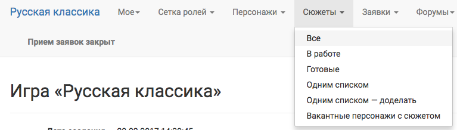
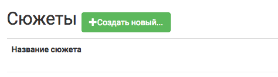
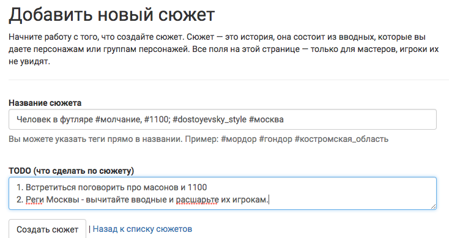
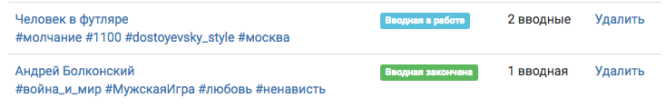
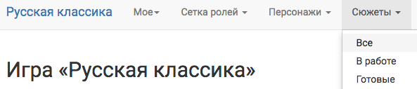

# Создание сюжета
**Меню → Сюжеты → Все → Создать новый**

После чего надо заполнить поля и нажать «сохранить».

## Поле «Название сюжета»
В поле «название сюжета», кроме непосредственно названия сюжета, можно для удобства дальнейшей навигации и структуризации сюжетов вставить *теги*.

 Сюжет можно создать только при наличии «названия». Тег названием не является.

## Теги
Тег обязательно начинаются со спец.символа хештег - #,
в тегах можно использовать *русские* и *латинские буквы*, *цифры* и *нижнее подчеркивание*. Все остальные спец. символы будут считаться частью названия сюжета,
для разделения между хештегами можно ставить *запятую, точку с запятой* или *пробел*.

## Поле TODO
Это поле - внутренний мастерский инструмент для того чтобы не забыть что нужно еще сделать.
Используйте его для того, чтобы отметить, какие тексты вы еще хотите написать, какие завязки подобрать, с какими мастерами что следует проговорить и т.п.

 Если это поле заполнено, то сюжет не будет переведен в статус «готов» даже если все вводные внутри сюжета будут готовы и опубликованы.

Нажав на «Сохранить», вы создадите сюжет.
Дальше можно продолжать работать с этим сюжетом и начать создавать Вводные, либо нажать «Назад к списку сюжетов» и вернуться к списку всех сюжетов.

.. _plot_status:
## Статусы сюжетов 

Статусы сюжетов соответствуют статусам вводных, из которых состоит сюжет.

Если в сюжете нет вводных, то статус сюжета будет «в работе».
Если в сюжете есть хотя бы одна вводная «в работе», то статус сюжета будет «в работе».
Если в сюжете все вводные закончены, но заполнено поле TODO, то статус сюжета будет «в работе».

 Можно вывести на станицу все сюжеты, либо только "в работе", либо только "готовые". Для этого надо выбрать один из подпунктов в меню проекта:

