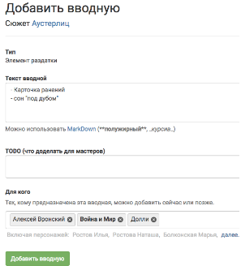
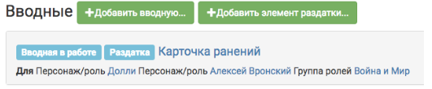

# Элементы раздатки

Игроки не видят этого раздела ни при каких условиях. 
Он предназначен для упрощения мастерского труда при формировании раздатки - конверт с физическими вещами которые получает игрок па полигоне непосредственно перед игрой. Такими вещами могут быть: карточки болезни, игровые деньги, паспорт, браслет игрока, специфические вещи напрямую связанные с сюжетом и вводной. 
Раздел «элементы раздатки» концентрируется на последних. 
О раздатках в общем можно почитать в соответствующем разделе *(будет позже)*.

Принцип добавления элементов раздатки аналогичен вводным - заполняем поля и нажимаем «добавить вводную». 

На странице сюжета результат выглядит так же как вводная, с пометкой «раздатка», чтобы не перепутать. 

Так же как и вводную, элемент раздатки можно «опубликовать». Но, в данном случае, механизм «опубликования» нужен только для смены статуса элемента раздатки с «в работе», на «готов».

Что делать дальше с элементами раздатки, читайте в разделе про раздатки *(в работе)*.
