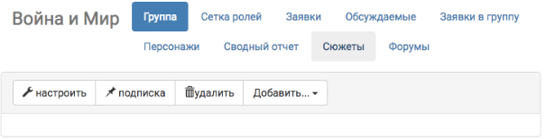
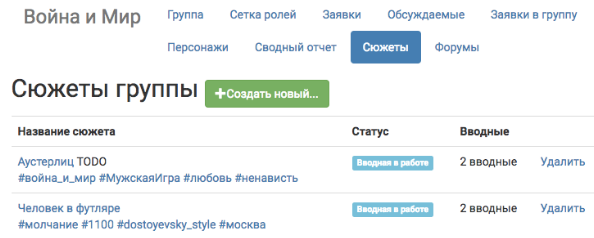
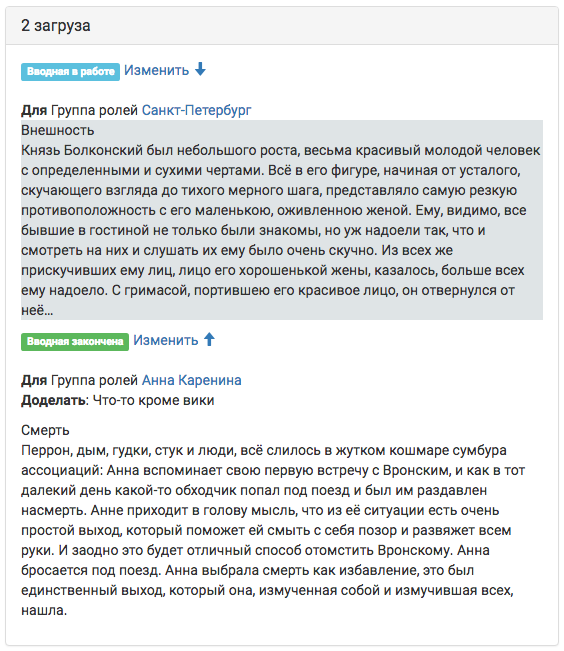
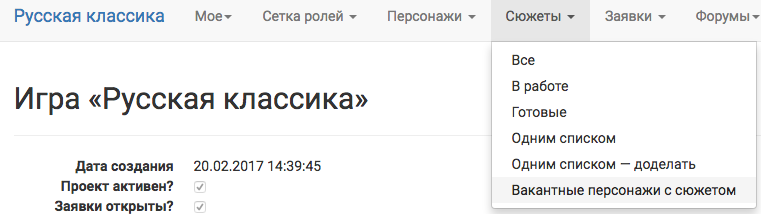

# Прочее 

## Сюжеты на странице группы
Для того чтобы посмотреть все сюжеты, связанные с конкретной группой из сетки ролей, надо открыть группу и нажать на вкладку «сюжеты».

**Меню → Сетка ролей → Группа → Сюжеты**

На эту страницу будут выведены все сюжеты, во вводных которых прописана заданная группа.

 С этой страницы также можно [создавать сюжеты](http://docs.joinrpg.ru/ru/latest/plot/creating-plot.html), но, обратите внимание, что сюжеты и вводные созданные с этой страницы **не будут** автоматически привязаны к данной группе.

## Вводные на странице персонажа
После привязки вводной к группе/персонажу, она становится доступна так же на странице персонажа. По умолчанию все вводные отсортированы по времени, но можно двигать их относительно друг друга.

## Сюжеты одним списком

**Меню → Сетка ролей → Группа → Сюжеты → Сюжеты одним списком**

Эта страница показывает все сюжеты в алфавитном порядке со всеми текстами всех вводных.
Это может быть полезно как и в работе - прочитать подряд все тексты, так и для распечатки вводных на мастерку.

Для того чтобы посмотреть тексты всех вводных со статусом «в работе», перейдите: Меню → Сетка ролей → Группа → Сюжеты → Сюжеты одним списком - доделать.

## Свободные персонажи с сюжетом

В этот список попадают все персонажи, у которых есть личная вводная, а игрока - нет.

