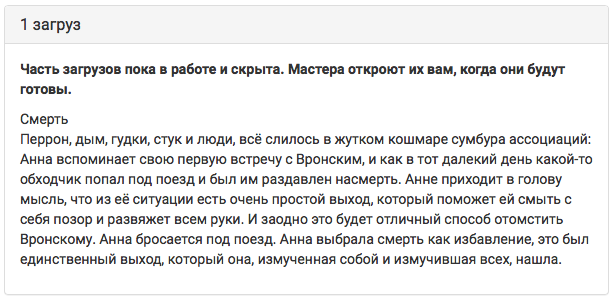

Прочее 
======
Сюжеты на странице группы
--------------------------
Для того чтобы посмотреть все сюжеты, связанные с конкретной группой из сетки ролей, надо открыть группу и нажать на вкладку «сюжеты».

**Меню → Сетка ролей → Группа → Сюжеты**

.. figure:: 
       :scale: 100 %
       :align: center
       :alt:

На эту страницу будут выведены все сюжеты, во вводных которых прописана заданная группа.

.. figure:: 
       :scale: 100 %
       :align: center
       :alt:

.. figure:: 
       :scale: 100 %
       :align: center
       :alt:
 

С этой страницы также можно `создавать сюжеты <http://docs.joinrpg.ru/ru/latest/plot/creating-plot.html>`_, но, обратите внимание, что сюжеты и вводные созданные с этой страницы **не будут** автоматически привязаны к данной группе.

Вводные на странице персонажа
------------------------------
После привязки вводной к группе/персонажу, она становится доступна так же на странице персонажа. По умолчанию все вводные отсортированы по времени, но можно двигать их относительно друг друга.

.. figure:: plot-on-char-page.png
       :scale: 100 %
       :align: center
       :alt: Вводные на странице персонажа

Игроки видят опубликованные сюжеты, как на страницах персонажа, так и на странице заявки вот так:

Сюжеты одним списком
---------------------

**Меню → Сетка ролей → Группа → Сюжеты → Сюжеты одним списком**

.. figure:: plot-all-in-one-list.png
       :scale: 100 %
       :align: center
       :alt: Сюжеты одним списком

Эта страница показывает все сюжеты в алфавитном порядке со всеми текстами всех вводных.
Это может быть полезно как и в работе - прочитать подряд все тексты, так и для распечатки вводных на мастерку.

.. hint:: Для того чтобы посмотреть тексты всех вводных со статусом «в работе», перейдите: Меню → Сетка ролей → Группа → Сюжеты → Сюжеты одним списком - доделать.

Вакантные персонажи с сюжетом
------------------------------

В этот список попадают все персонажи, у которых есть личная вводная, а игрока - нет.

.. figure:: plot-vacancies.png
       :scale: 100 %
       :align: center
       :alt: Сюжеты одним списком
