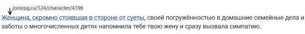
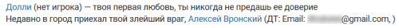
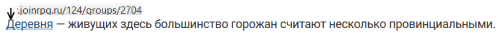
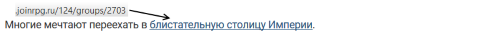
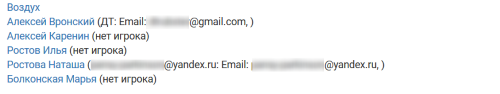

Специальные символы 
====================

Специальные символы работают во вводных и облегчают работу мастера по обмену контактами связанных друг с другом игроков и оформление ссылок на персонажей и группы из сетки ролей. При обновлении данных в сетке ролей (редактировании названия / смене игрока на роли и т.п.) вводная, в которой используются специальные символы в динамическом варианте, обновится автоматически.

Для работы со специальными символами используется ID персонажа и группы (можно взять из адресной строки)

Ссылка на персонажа
------------------------------------

**Динамический вариант**: имя в именительном падеже (как в сетке) + ссылка

    %персонаж4196 — твой контакт в Москве, вы договорились встретиться на балу и узнать друг друга по желтым бантам, приколотым у сердца.

.. figure:: to_character.png
       :scale: 100 %
       :align: center
       :alt: Ссылка на сетку ролей с динамическим именем

..attention:: При изменении имени персонажа в сетке ролей все его упоминания во вводных будут изменены на новое имя автоматически.

**Стабильный вариант**: ваш текст (в скобках) + ссылка

    %персонаж4196(Женщина, скромно стоявшая в стороне от суеты,) своей погружённостью в домашние семейные дела и заботы о многочисленных детях напомнила тебе твою жену и сразу вызвала симпатию.

..attention:: При изменении имени персонажа в сетке ролей его упоминания во вводных изменены не будут, всегда будет использоваться только указанный вами стабильный вариант.

Контакты игрока
------------------------------------

После имени персонажа в именительном падеже (как в сетке ролей) будут показаны имя и контакты игрока, указанные им в профиле. Если игрок не утвержден, то после персонажа будет отметка _«нет игрока»_.

    %контакты4196 — твоя первая любовь, ты никогда не предашь ее доверие.

    Недавно в город приехал твой злейший враг, %контакты4199

	
..  note:: Контакты показываются для игрока, принятого на роль. Контакты непринятых заявок не показываются. 

.. attention:: В том случае, если для персонажа выбрана опция «скрывать игрока», при использовании специальных символов его имя и контакты будут показаны все равно.

Ссылка на группу
-------------------------

**Динамический вариант**: название в именительном падеже (как в сетке) + ссылка

    %группа2704 — живущих здесь большинство горожан считают несколько провинциальными.

	
..attention:: При изменении названия группы в сетке ролей все ее упоминания во вводных будут изменены на новое имя автоматически.

**Стабильный вариант**: ваш текст (в скобках) + ссылка

    Многие мечтают переехать в %группа2703(блистательную столицу Империи).

	
..attention:: При изменении названия группы в сетке ролей ее упоминания во вводных изменены не будут, всегда будет использоваться только указанный вами стабильный вариант.

Контакты членов группы
------------------------------------

После названия группы в именительном падеже (как в сетке ролей) будут показаны все персонажи с именами и контактами (почта, телефон, социальные сети) игроков, указанных в их профилях. Если игрок не утвержден, то после персонажа будет отметка _«нет игрока»_.

    %список2719

.. attention:: В том случае, если для какого-либо персонажа из группы выбрана опция «скрывать игрока», при использовании специальных символов его имя и контакты будут показаны все равно.

.. hint:: Показывать контакты можно для любой группы: не только общедоступной из сетки ролей, но также `специальные <http://docs.joinrpg.ru/ru/latest/groups/hidden-group.html#id5>`_ и `скрытые <http://docs.joinrpg.ru/ru/latest/groups/hidden-group.html>`_ группы
