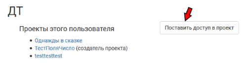
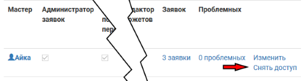

Доступ в проект
=============
.. attention:: Все мастера проекта всегда показываются на его домашней странице, а также в профиле пользователя видно, какие проекты он администрирует и/или создал.

Добавление нового мастера
----------------------------------------
Откройте профиль нужного мастера, в нем будет кнопка «Поставить доступ в проект». Вы можете добавить мастера в любой созданный вами проект или в чужой, в котором у вас есть право добавлять новых пользователей. 

.. hint:: Пользователя можно найти поиском по нику / фамилии / имени. Или просто попросить дать прямую ссылку на профиль.

Уровень прав доступа можно выбрать при добавлении мастера или позже, отредактировав из списка мастеров.

Права доступа
---------------------
Для того, чтобы отредактировать права доступа мастеров проекта, перейдите:

**Меню > Прочее > Мастера** 

Доступ к тем или иным разделам может быть проставлен в любой комбинации. В том случае, если у мастера не стоит никаких дополнительных прав, он может писать комментарии в заявках и видеть любые мастерские материалы в базе.

* Администратор заявок — может изменять статус заявок (принимать, отклонять, переносить в лист ожидания) и переназначать ответственного мастера для любой заявки в базе
* Настраивать поля персонажа — может добавлять, удалять или редактировать поля заявки и поля персонажа (*о них будет написано позже*)
* Настраивать проект — может изменять свойства проекта, переименовывать его, отправлять проект в архив и т.д.
* Давать доступ другим мастерам — может добавлять или удалять пользователей, настраивать права доступа
* Редактировать ролевку — может добавлять новые группы или новых персонажей, редактировать и удалять группы и персонажей
* Управлять финансами — может настраивать размеры взносов и способы оплаты, а также редактировать общие настройки финансового блока (*подробная справка по настройке финансов в работе*)

.. hint:: Даже без доступа к управлению другим мастерам доступна общая статистика по взносам. 

.. note:: Принимать взносы может любой мастер, указанный в «Способах оплаты». Для этого не нужен никакой доступ, кроме добавления в проект.
 
* Делать массовые рассылки — может разослать письма на емейл любой группе игроков (включая особые фильтры типа «все не сдавшие взносы», про них можно будет прочитать в соответствующем разделе)

.. note:: Мастер без доступа к массовым рассылкам могут делать рассылки по игрокам, для которых он — ответственный мастер. В таком случае из выбранной для рассылки группы будут отфильтрованы только «его» заявки. 

* Редактор сюжетов — может добавлять и удалять сюжеты и вводные, назначать группы и персонажей, которым они видны.

Снятие доступа
-----------------------
Снимать доступ могут мастера с уровнем прав «Давать доступ другим мастерам». Для того, чтобы снять права доступа, перейдите:

**Меню > Прочее > Мастера** 

Выберите **«Снять доступ»** в строке нужного мастера и подтвердите действие.

.. hint:: Если вы не создатель проекта, то снимать доступ можно не только с других, но и с себя.

Все заявки, для которых ответственным мастером был человек, с которого сняли доступ, будут отмечены как проблемные «Неверный мастер». Вы можете найти их на странице **Меню > Заявки > Проблемные**. 

.. attention:: Не забудьте поменять ответственного мастера в настройках групп. 

При восстановлении доступа к проекту все заявки, для которых ответственный мастер не был заменен, автоматически вернутся к прежнему мастеру и исчезнут из проблемных. 
