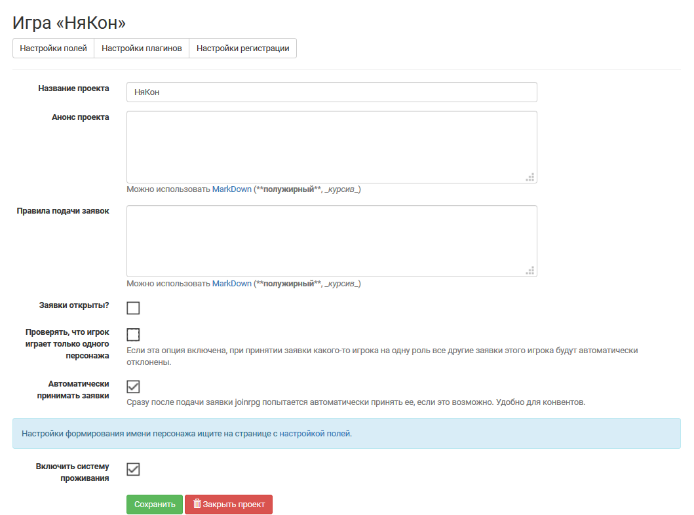

Создание нового проекта 
====================
Для создания новой базы заявок необходим аккаунт пользователя joinrpg. Если у вас его нет — то `зарегистрироваться просто <http://docs.joinrpg.ru/ru/latest/register/index.html>`_ (например, возможна регистрация со своим аккаунтом вконтакте или google-аккаунтом). 

После нажатия на кнопку **«Создать базу заявок»** вводится название игры — в дальнейшем оно будет показываться как заголовок для страниц вашей базы заявок и в списке игр на главной странице joinrpg. Название игры можно отредактировать в свойствах проекта.

Для проектов предусмотрены **три шаблона настроек** (выбираются при создании базы заявок):

1. **Ролевая игра**. Автопринятие заявок и система проживания отключены, опция «Проверять, что игрок играет только одного персонажа» включена. В списке полей заявки / персонажа есть автоматически созданные поля «Имя персонажа» и «Описание персонажа». 
2. ** Конвент**. Заявки участников будут приниматься автоматически, «имя персонажа» формироваться из имени игрока в его профиле. Опция «Проверять, что игрок играет только одного персонажа» включена, `система проживания <http://docs.joinrpg.ru/ru/latest/accommodation/index.html>`_ включена.
3. **Конвент: мероприятия**. 

Все настройки, проставленные в рамках шаблона, могут быть изменены. О том, как можно редактировать поля заявки / персонажа, подробнее рассказано в `соответствующем разделе документации <http://docs.joinrpg.ru/ru/latest/fields/index.html>`_.

`Закрывайте проект <http://docs.joinrpg.ru/ru/latest/project/after.html>`_ после завершения игры, чтобы список игр на главной странице сайта был актуальным.

Правила использования joinrpg для ваших проектов
---------------------------------------------------

1. Joinrpg — для ролевых игр. Если ваше мероприятие не является ролевой игрой или ролевым конвентом, просьба согласовать возможность использования joinrpg отдельно по адресу support@joinrpg.ru
2. Надеемся, что вам понравится наш сайт. Мы сами мастера и делаем его для других мастеров. Ведите себя адекватно, используйте сайт по назначению и все будет здорово.
3. Если у вас будут какие-то проблемы, пишите в поддержку. Мы всегда рады помочь, но обратите внимание: вы ничего не платите нам, и, следовательно, не являетесь нашим клиентом. Мы поддерживаем сайт бесплатно и в свободное время, у нас есть работа, семья, личная жизнь, другие хобби.
4. Вы можете обсудить проблему с другими пользователями в чате в телеграмме. Это часто самый быстрый способ получить ответ. Если вам нужна именно наша помощь, напишите в техподдержку, чат мы не всегда просматриваем.
5. Мы будем вынуждены заблокировать тех пользователей, которые нарушают общепринятые правила интернетов. Это включает (но не ограничивается): спам, взлом нашего или других сайтов, любые другие действия, которые ставят нас под угрозу технически или юридически. Мы не ограничиваем себя определенным списком или правилами, но постараемся применять блокировки только как крайнюю меру. Пока что такой необходимости не возникало. Мастерская группа в целом отвечает за поведение на сайте каждого конкретного мастера.
6. Если вам нужна какая-то доработка или не совсем удобно использовать наш сайт, мы с радостью обсудим доработки, но команда сайта не может гарантировать никаких сроков. Код сайта open source, вполне возможно, вам самим удастся найти программиста. В прошлом мы заключали сделки вроде «доработки за пожертвование» и готовы обсудить их снова.
7. Если кто-то ведет себя как м...к по отношению к нам, мы не даем таким людям согласия на использование нашего сайта.
8. Рады вас видеть и удачной вам игры!

Свойства проекта 
-------------------------
**Меню > Прочее > Свойства проекта** 

В свойствах проекта можно задать и/или отредактировать:

* **Название проекта** (игры)
* **Анонс проекта**, который размещается на домашней странице вашей базы заявок (`вот так, например <http://joinrpg.ru/1/home>`_)
* **Правила подачи заявок**, которые демонстрируются при любой новой заявке на эту игру
* Поставьте галочку **«Заявки открыты»**, как только будете готовы принимать заявки от игроков

.. note:: До открытия непосредственного приема заявок игроки могут смотреть сетку ролей и любые материалы, которые вы разместите в базе в общем доступе, если им известна ссылка на проект.

* При активной опции «Проверять, что игрок играет только одного персонажа» при принятии одной из заявок игрока, подавшего больше одной заявки, все остальные заявки этого игрока на другие роли будут автоматически отклонены. 

О том, как **закрыть проект**, подробнее сказано в разделе `«После игры» <http://docs.joinrpg.ru/ru/latest/project/after.html>`_.
