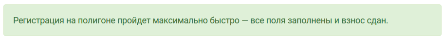
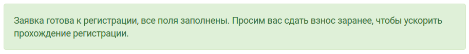
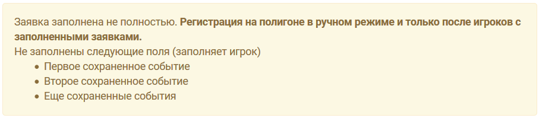
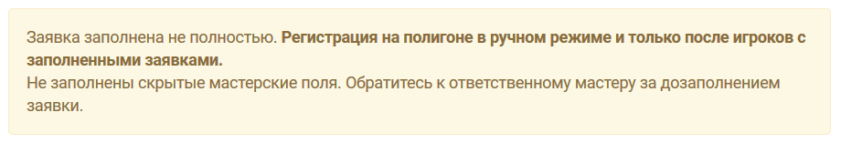
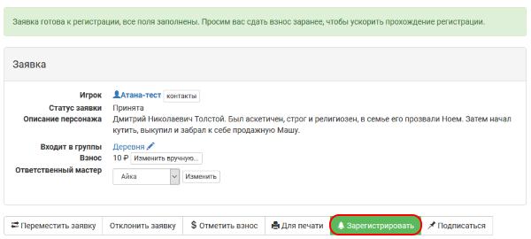
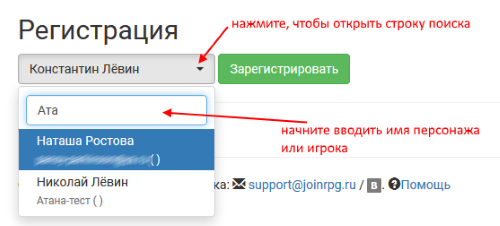

Регистрация на полигоне
========================

С помощью joinrpg можно регистировать игроков, приезжающих на полигон. Преимущества перед традиционной регистрацией по спискам:

* оперативность регистрации игроков;
* актуальная статитиска по текущему заезду в локации, доступная в режиме реального времени;
* прозрачный прием и учет взносов;
* легко зарегистировать и подготовить раздатку для игроков, выходящих второй ролью.

Подготовка до полигона
---------------------

Для того, чтобы включить модуль регистрации, пройдите в своем проекте: 
**Прочее > Настройки > Настройки регистрации**
Выберите опцию «Включить модуль регистрации». Сохраните настройки.

После **включения модуля регистрации** игроки в принятых заявках увидят уведомление о том, насколько их заявки готовы к регистрации на полигоне. Уведомления бывают следующих типов:

* заявка полностью готова, взнос сдан;

* заявка полностью готова, взнос не сдан;

* необходимые поля не заполнены игроков, список того, что следует подготовить, выводится в статусе;

	   
* не заполнены скрытые мастерские поля, требуется  обратиться к ответственному мастеру за дозаполнением заявки;

* необходимые поля требует заполнения и мастером, и игроком, список доступных игроку полей выводится в статусе.	   
	   
.. attention:: Препятствующими прохождению регистрации считаются любые поля, которые помечены как рекомендованные или обязательные.

Включение регистрации на полигоне
-------------------------------

Чтобы начать регистрацию приезжающих на игру, пройдите в своем проекте: 
**Прочее > Настройки > Настройки регистрации**
Выберите опцию «Регистрация в процессе». Сохраните настройки.

Теперь заявках появилась опция «Зарегистировать».

Рекомендуемый интерфейс для регистрации доступен через: **Прочее > Регистрация**. 
В выпадающем списке персонажей доступен поиск по любому параметру:

* имени персонажа;
* имени, или фамилии, или нику.

	   
Сдачу взноса можно отметить как через функцию «Отметить взнос» в заявке, так и непосредственно во время регистрации игрока, как показано ниже на скриншоте окна регистрации. 
Убедитесь, что добавили мастеров, которые могут принимать взносы во время регистрации, в список возможных способов оплаты (как «Наличными — %Имя мастера%»). В противном случае для мастера будет доступна регистрация только тех, кто взнос уже сдал.

.. hint:: Может быть удобно разделить очереди для игроков со сданным взносом и с необходимостью оплаты. Сдавших взнос смогут регистировать любые мастера с доступом в проект.

.. figure:: checking_in.png
       :scale: 100 %
       :align: center
       :alt: Экран регистрации

На экране регистрации выводится список <раздатки 'http://docs.joinrpg.ru/ru/latest/plot/handout.html'>_ — физических вещей, которые получает игрок на полигоне непосредственно перед игрой. В том случае, если вы не формировали конверты для игроков заранее, игрок может получить требуемые вещи по этому списку прямо на регистрации.

После нажатия кнопки «Зарегистрировать игрока

Статистика зарегистрированных
--------------------------------

Выход вторыми ролями
---------------------
