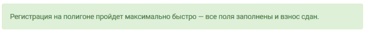
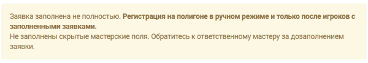

Подготовка до полигона
========================

Для того, чтобы включить модуль регистрации, пройдите в своем проекте: 
**Прочее > Настройки > Настройки регистрации**
Выберите опцию «Включить модуль регистрации». Сохраните настройки.

После **включения модуля регистрации** игроки в принятых заявках увидят уведомление о том, насколько их заявки готовы к регистрации на полигоне. Уведомления бывают следующих типов:

* заявка полностью готова, взнос сдан;

* заявка полностью готова, взнос не сдан;

.. figure:: need_money.png
       :scale: 100 %
       :align: center
       :alt: Все поля заполнены, но взнос не сдан	   

* необходимые поля не заполнены игроком, список того, что следует подготовить, выводится в статусе;

.. figure:: player_to_do.png
       :scale: 100 %
       :align: center
       :alt: Не заполнены поля игроком
	   
* не заполнены скрытые мастерские поля, требуется  обратиться к ответственному мастеру за дозаполнением заявки;

* необходимые поля требуют заполнения и мастером, и игроком, список доступных игроку полей выводится в статусе.	   
	   
.. attention:: Препятствующими прохождению регистрации считаются любые поля, которые помечены как рекомендованные или обязательные.
