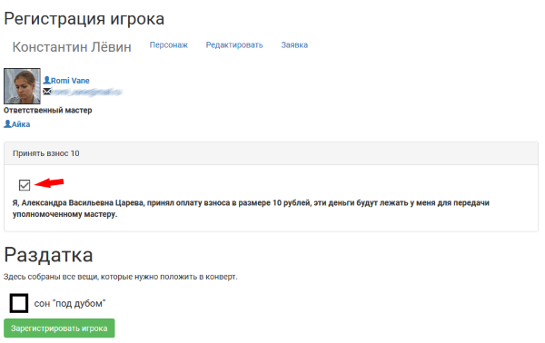

Включение регистрации на полигоне
========================

Чтобы начать регистрацию приезжающих на игру, пройдите в своем проекте: 
**Прочее > Настройки > Настройки регистрации**
Выберите опцию «Регистрация в процессе». Сохраните настройки.

Теперь заявках появилась опция «Зарегистировать».

.. figure:: checkin_allowed.png
       :scale: 100 %
       :align: center
       :alt: Кнопка регистрации

Рекомендуемый интерфейс для регистрации доступен через: **Прочее > Регистрация**. 
В выпадающем списке персонажей доступен поиск по следующим параметрам:

* имя персонажа;
* имя, или фамилия, или ник игрока.

.. figure:: checkin_control.png
       :scale: 100 %
       :align: center
       :alt: Строка поиска для регистрации
	   
Сдачу взноса можно отметить как через функцию «Отметить взнос» в заявке, так и непосредственно во время регистрации игрока, как показано ниже на скриншоте окна регистрации. 
Убедитесь, что добавили мастеров, которые могут принимать взносы во время регистрации, в список возможных способов оплаты (как «Наличными — %Имя мастера%»). В противном случае для мастера будет доступна регистрация только тех, кто взнос уже сдал.

.. hint:: Может быть удобно разделить очереди для игроков со сданным взносом и с необходимостью оплаты. Сдавших взнос смогут регистировать любые мастера с доступом в проект.

На экране регистрации выводится список 'раздатки <http://docs.joinrpg.ru/ru/latest/plot/handout.html>'_ — физических вещей, которые получает игрок на полигоне непосредственно перед игрой. В том случае, если вы не формировали конверты для игроков заранее, игрок может получить требуемые вещи по этому списку прямо на регистрации.

После нажатия кнопки «Зарегистрировать игрока» статус заявки меняется на «Игрок заехал», она учитывается в списке зарегистированных игроков и больше не отображается в списке персонажей, доступных для регистрации. В заявке автоматически оставляется комментарий «Пройдена регистрация на полигоне» от имени зарегистрировавшего мастера.

.. attention:: Для регистрации доступны только персонажи, заявка на которых принята. Непринятые заявки и персонажи без игрока в список не попадают.
